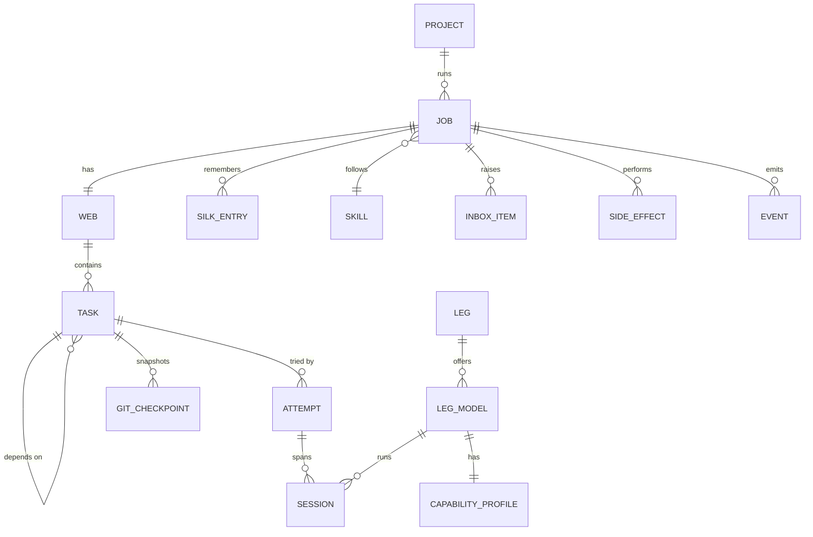
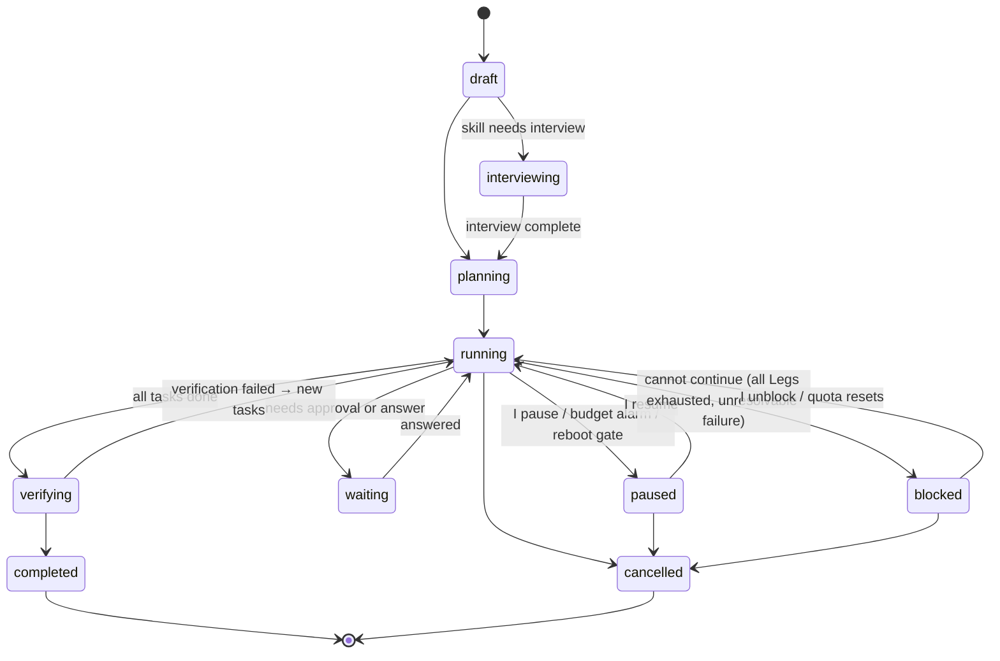

# Core Entities

Everything Oraknid holds lives in the daemon's database (see
[[Persistence-and-Recovery]]). Wire shapes are defined once in
`packages/contracts`. IDs are ULIDs, so they sort by creation time.

## Project

| Field | Meaning |
| :-- | :-- |
| `id`, `name` | |
| `workspacePath` | Absolute path to the folder or repo. |
| `isGitRepo` | Detected on creation. Non-git folders are `git init`ed into a shadow repo under `.oraknid/` for checkpoints (see [[Sandboxing]]). |
| `releaseBranch`, `workBranch` | Detected from the repo. Fallback is `main` / `dev` (rule BR-14). |
| `createdAt`, `archivedAt` | |

**Life cycle:** active → archived (hidden from lists, kept for stats,
takes no new jobs; restorable) → deleted (only on my request, refused
while a job of it is going; its jobs and their history leave Oraknid; my
folder, the job branches and the worktrees in it stay).

## Job

| Field | Meaning |
| :-- | :-- |
| `id`, `projectId`, `title`, `goal` | The goal is free text in my words. |
| `inputs` | Extra docs, folders or links attached on creation. |
| `skillId`, `skillVersion` | The skill is pinned to a version for the job's whole life. |
| `autonomy` | `supervised` · `standard` · `full` (see [[Approvals-and-Autonomy]]). |
| `allowedLegIds` | Empty means "any healthy Leg". |
| `budget` | See [[Budgets-and-Quotas]]. |
| `state` | See below. |
| `pauseReason`, `blockedReason` | Written in my language, shown in the UI. |
| `resumeState` | The active state a `paused`, `waiting` or `blocked` job returns to. |
| `worktree`, `branch` | Where the job works (Sandboxing). |
| `verify`, `verifyRound` | Job-level checks (the skill's, mine, the plan's); rounds of verification so far. |
| `blockedUntil` | When a job blocked on quota resumes on its own. |
| `waived`, `unsandboxed` | Gates I waived; whether I chose to run it without the sandbox. |
| `createdAt`, `startedAt`, `finishedAt` | |

**States:**

`interviewing`, `planning`, `running` and `verifying` are **active**
states. Any active job holds the sleep inhibitor (BR-11).

## The Web and Task

The Web is the set of a job's tasks and their dependency edges, plus
a version number that increases on every plan change.

| Task field | Meaning |
| :-- | :-- |
| `id`, `jobId`, `title`, `instructions` | |
| `dependsOn[]` | Task IDs that must be `done` first. |
| `kind` | `plan` · `implement` · `test` · `review` · `research` · `mechanical` · `external` (an action with a side effect). |
| `scope` | Paths the task may change (globs). Edits outside it are drift. |
| `verify[]` | Commands The Eye runs to accept the task. |
| `requiredCapabilities[]` | Used by routing (see [[The-Eye]]). |
| `state` | `pending` · `ready` · `assigned` · `running` · `verifying` · `done` · `failed` · `skipped` · `paused` |
| `difficulty` | `low` · `medium` · `high`, estimated at planning, revised after failures. |
| `assignedLegId`, `assignedModelId`, `effort`, `attemptCount` | |
| `routing` | Why the router chose its Leg model: score, reasons, what it left out. |
| `stepUp`, `avoid`, `escalation` | Escalation state across attempts (ADR-013, Drift-Control). |
| `pinnedModelId`, `ownerHeld` | I pinned it to a Leg model; I took it over (BR-18). |
| `position`, `planKey` | Plan order, and the plan's own key for the task. |
| `budget` | Optional per-task limits. |

## Attempt and Session

An **attempt** is one Leg's try at one task. It ends `succeeded`,
`failed`, `reassigned` or `abandoned`, and records the escalation steps
used. A **session** is one process or conversation of that Leg within
the attempt, on one Leg model and effort level. It records the Leg's native session ID (for resume), its
start and end, the tokens in and out, the context size reached, and
why it ended (`completed`, `rotated`, `interrupted`, `killed`, `crashed`,
`rate-limited`).

## Leg and Capability Profile

| Leg field | Meaning |
| :-- | :-- |
| `id`, `name`, `kind` | e.g. "Claude — personal", `claude-code`. |
| `config` | Kind-specific: binary path, config directory, endpoint URL, model name. No secrets. Those are referenced in the keychain. |
| `secretRef` | Keychain entry, if any. |
| `enabled`, `health` | `healthy` · `degraded` · `rate-limited` · `unavailable` · `disabled`. |
| `quota` | The latest known account-wide quota windows and when they reset. |

## Leg model

| Field | Meaning |
| :-- | :-- |
| `id`, `legId`, `model` | The model's identifier as the agent or server names it, e.g. `opus`, `qwen3-coder:30b`. |
| `displayName`, `hidden` | |
| `effortLevels` | Supported levels, if any. |
| `quota` | Windows that apply only to this model (e.g. a weekly Opus window). |

Its capability profile is described in [[Legs-and-Capability-Profiles]].

## Silk entry

| Field | Meaning |
| :-- | :-- |
| `id`, `jobId`, `taskId?` | |
| `kind` | `decision` · `architecture` · `progress` · `issue` · `handoff` · `fact` · `interview-answer` · `later` |
| `title`, `body` | Markdown, short by design. |
| `supersedes?` | The entry this one replaces. Old entries are kept but marked. |
| `covers` | For a summary: the entries it replaces together. |
| `authoredBy` | `eye`, a Leg ID, or `owner`. |

## Inbox item

`approval` or `question`. Records who raised it (The Eye or a Leg), the
job and task, the exact action or question, the options, the default,
the state (`open` · `answered` · `expired` · `withdrawn`), and the answer
with its time and device.

## Eye message

One message in my conversation with The Eye about a job: the author
(`owner` or `eye`), the text, and for The Eye's replies what it made of
my message (`instruction` · `task` · `context` · `later` · `stop` ·
`question`) and what it did (Silk entries, tasks added). Kept forever,
with the job.

## Side effect

Every external action (send an email, push, deploy, call an API that
writes). It has an **idempotency key** (`job:task:name`) and a state:
`intended` (gated, waiting for me) → `approved` → `performing` (recorded
just before it runs) → `performed` → `confirmed`, or `failed` / `denied`.
An action found in `performing` after a crash or an interrupted pause is
checked by its action's reconciler. If that can't tell, I'm asked
whether it happened. It is never blindly repeated (BR-6).

## Event

Each carries its `actor` (`owner`, `eye`, `leg:<id>`, `oraknid`).
The append-only stream of everything that happened: state changes, Leg
output chunks (summarised), usage samples, drift detections, escalations,
approvals. It feeds the live UI, the stats and the audit log.

## Skill

`id`, `name`, `source` (`built-in` · `uploaded`), the markdown body,
versions, parsed front matter (`name`, `description`, `requires.tools[]`,
`interview: true|false`).

## Device

A paired browser or phone: name, public key, paired-at, last seen,
revoked-at, and notification preferences.

Related: [[Business-Rules]] · [[Glossary]] · [[Data-Map]] · [[Persistence-and-Recovery]]
