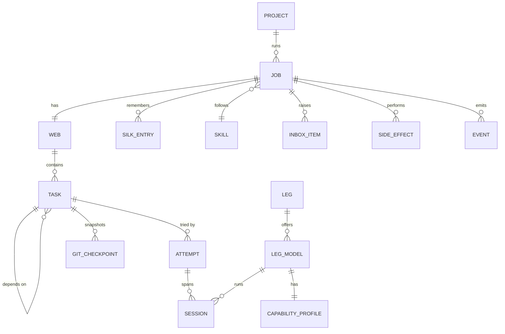
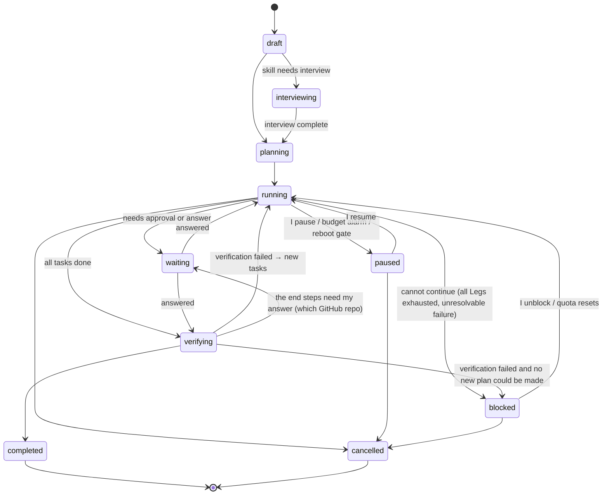

# Core Entities

Everything Oraknid holds lives in the daemon's database (see
[[Persistence-and-Recovery]]). Wire shapes are defined once in
`packages/contracts`. IDs are ULIDs, so they sort by creation time.

## Project

| Field | Meaning |
| :-- | :-- |
| `id`, `name` | |
| `workspacePath` | Absolute path to the folder or repo. |
| `isGitRepo`, `shadow` | Detected on creation. A non-git folder I don't `git init` gets a shadow repo in Oraknid's data folder for checkpoints (see [[Sandboxing]]). |
| `releaseBranch`, `workBranch` | Detected from the repo. Fallback is `main` / `dev` (rule BR-14). |
| `createdAt`, `archivedAt` | |
| `archivedWith` | What archiving did besides hiding it (2026-10-04, migration 0036): `githubArchived` (the GitHub repos it archived) and `folderDeleted`; null when it isn't archived. Unarchiving reads it ([[Jobs-and-Projects]] → Archiving and deleting a project). |
| `skillIds` | The skills its jobs may use; The Eye picks one per job (Phase 8). Empty: the default. |
| `serverIds` | The servers its jobs may use, none by default ([[Servers]]). |
| `serverId` | Set on a server's own project only (2026-10-04, migration 0037, [[ADR-049-Server-Chat-And-Server-Jobs]]): made with the server's first chat message, hidden from Projects, its jobs are the server's jobs. |
| `serverRoles` | Each of its servers' role in it, by server id (2026-10-03, [[ADR-042-Several-Repos-And-Servers]]): `role` (a word of mine: testing, staging, production…) and `production` (true or false when I marked it; null: production when the role is `production` or `prod`). |
| `repos` | Its git repositories (2026-10-03, [[ADR-042-Several-Repos-And-Servers]]): one with `folder` "" when its folder is the repo, several each in its folder, none when it isn't a git repo. Each: `name` (in the project; its folder's last part by default), `folder`, `releaseBranch`, `workBranch`, `github` (its link, or none: `account`, `owner`, `name`, `visibility`, `origin` new or existing, `ready`, `linkedAt`, [[ADR-038-Project-Accounts]]). For a project of one repo, the project's own branches are its repo's. |
| `github` | In the API's view only: the link of a project of one repo (its repo's), null for several. Until 2026-10-03 the project's single link was stored here; migration 0031 moved it into its one repo. |

Its local ports (what its jobs' sandboxes may reach on this computer)
are a setting, `project.localPorts.<project>` ([[Sandboxing]]). Its
**budget** across its jobs (tokens and money, both optional; a new job's
default) is a setting too, `project.budget.<project>`
([[Budgets-and-Quotas]] → A project's budget, [[ADR-034-Projects-First]]).
A project is where I work: its conversation with The Eye is its jobs'
messages together, and its Silk is its jobs' Silk, kept by job.

**Life cycle:** active → archived (hidden from lists, kept for stats,
takes no new jobs; restorable; its GitHub repos archived and its folder
deleted if I chose, the folder cloned back when it is unarchived) →
deleted (only on my request, refused while a job of it is going unless
I cancel it; its jobs and their history leave Oraknid; my folder, the
job branches and the worktrees in it stay unless I tick the folder, and
its GitHub repos unless I tick them; [[Jobs-and-Projects]] → Archiving
and deleting a project).

## Job

| Field | Meaning |
| :-- | :-- |
| `id`, `projectId`, `title`, `goal` | The goal is free text in my words, kept as I wrote it. The title is a name The Eye gives it, or mine; its goal's first line until then. |
| `namedBy` | Who named it (2026-10-04, [[Jobs-and-Projects]] → A job's name and description): `me` (typed or renamed, kept), `eye`, or null (still its first line). |
| `description`, `describedAs` | One or two plain sentences: what it's for (`purpose`), what it did once it ended (`outcome`), or mine (`mine`, kept). |
| `inputs` | Extra docs, folders or links attached on creation. |
| `skillId`, `skillVersion` | The skill is pinned to a version for the job's whole life. |
| `autonomy` | `auto` (default) · `careful` · `full` (2026-10-07, [[ADR-053-Auto-Mode]]; `standard` and `supervised` were moved to `auto` and `careful` by migration 0039 and still parse; see [[Approvals-and-Autonomy]]). |
| `allowedLegIds` | Empty means "any healthy Leg". |
| `budget` | See [[Budgets-and-Quotas]]; with `claudeShare`, the most of its attempts that may run on Claude when its tasks climb (2026-10-07, [[ADR-052-A-Harness-For-Any-Model]] §3). |
| `state` | See below. |
| `pauseReason`, `blockedReason` | Written in my language, shown in the UI. |
| `resumeState` | The active state a `paused`, `waiting` or `blocked` job returns to. |
| `worktree`, `branch` | Where the job works (Sandboxing). In a project of several repos, `worktree` is the job's folder and `branch` the job branch's name in every repo. |
| `repos` | In a project of several repos: the ones it opened, each `{name, folder, worktree}`, the worktree at its folder inside the job's folder ([[ADR-042-Several-Repos-And-Servers]]). |
| `verify`, `verifyRound` | Job-level checks (the skill's, mine, the plan's); rounds of verification so far. |
| `blockedUntil` | When a job blocked on quota resumes on its own. |
| `waived`, `unsandboxed` | Gates I waived; whether I chose to run it without the sandbox. |
| `priority`, `queuedAt` | Its place among queued jobs; when it started waiting for a slot ([[ADR-016-Parallel-Work]]). |
| `tools` | The tools its sessions get, by name ([[ADR-021-Tools-Broker]]). |
| `skillChoices` | The project's skills The Eye chooses from when I didn't pick one; empty once chosen. |
| `allowRules`, `denyRules` | My command rules for this job ([[Security]]). |
| `createdAt`, `startedAt`, `finishedAt` | |

A **follow-up job** (2026-10-03) starts its branch from the ended job's
branch, kept in the setting `job.startFrom.<job>`
([[Jobs-and-Projects]] → Follow-up jobs).

**States:**

`interviewing`, `planning`, `running` and `verifying` are **active**
states. Any active job holds the sleep inhibitor (BR-11).

## The Web and Task

The Web is the set of a job's tasks and their dependency edges, plus
a version number that increases on every plan change.

| Task field | Meaning |
| :-- | :-- |
| `id`, `jobId`, `title`, `instructions` | |
| `dependsOn[]` | Task IDs that must be `done` first. |
| `kind` | `plan` · `implement` · `test` · `review` · `research` · `mechanical` · `external` (an action with a side effect). |
| `scope` | Paths the task may change (globs). Edits outside it are drift. |
| `verify[]` | Commands The Eye runs to accept the task. |
| `requiredCapabilities[]` | Used by routing (see [[The-Eye]]). |
| `state` | `pending` · `ready` · `assigned` · `running` · `verifying` · `done` · `failed` · `skipped` · `paused` |
| `difficulty` | `low` · `medium` · `high`, estimated at planning, revised after failures. |
| `assignedLegId`, `assignedModelId`, `effort`, `attemptCount` | |
| `routing` | Why the router chose its Leg model: score, reasons, what it left out. |
| `stepUp`, `avoid`, `escalation` | Escalation state across attempts (ADR-013, Drift-Control). |
| `pinnedModelId`, `ownerHeld` | I pinned it to a Leg model; I took it over (BR-18). |
| `position`, `planKey` | Plan order, and the plan's own key for the task. |
| `commit`, `commits` | Its work's commit once done; in a project of several repos, its commit in each repo it changed (`{repo, sha}`), `commit` the first. |
| `budget` | Optional per-task limits. |

## Attempt and Session

An **attempt** is one Leg's try at one task. It ends `succeeded`,
`failed`, `reassigned`, `redirected` (I said how to go on: try again with
my advice, another Leg; not counted against the task, ADR-056),
`abandoned`, or `unavailable` (its provider failed or hit a usage limit:
not counted against the task, M13.22), and records the escalation steps
used. Only `failed` and `reassigned` count toward the task's attempt
limit; my choices (leave it out, I'll do it, stop the job, try again)
are never learned as the model's failure. A **session** is one process or conversation of that Leg within
the attempt, on one Leg model and effort level. It records the Leg's native session ID (for resume), its
start and end, the tokens in and out, the context size reached, and
why it ended (`completed`, `rotated`, `interrupted`, `killed`, `crashed`,
`rate-limited`).

## Leg and Capability Profile

| Leg field | Meaning |
| :-- | :-- |
| `id`, `name`, `kind` | e.g. "Claude — personal", `claude-code`. Kinds: `claude-code`, `openai-compatible`, `opencode`, `antigravity`, `oraknid-agent` (2026-10-07). |
| `config` | Kind-specific: binary path, config directory, endpoint URL, model name. No secrets. Those are referenced in the keychain. |
| `secretRef` | Keychain entry, if any. |
| `enabled`, `health` | `healthy` · `degraded` · `rate-limited` · `unavailable` · `disabled`. |
| `quota` | The latest known account-wide quota windows and when they reset. |
| `limitedUntil` | Out of quota or resting after a provider failure until then, read from its own words ("Resets in 51h49m11s"); never routed to before (M15.1). |
| features | What its probe found it can do (`resume`, `tools`, usage reported or estimated, quota windows), kept in the setting `leg.features.<leg>` (2026-10-07, [[ADR-056-The-Harness]] §2): resume follows it, never a list of kinds. |

## Leg model

| Field | Meaning |
| :-- | :-- |
| `id`, `legId`, `model` | The model's identifier as the agent or server names it, e.g. `opus`, `qwen3-coder:30b`. |
| `displayName`, `hidden` | |
| `effortLevels` | Supported levels, if any. |
| `quota` | Windows that apply only to this model (e.g. a weekly Opus window). |

Its capability profile is described in [[Legs-and-Capability-Profiles]].

## Silk entry

| Field | Meaning |
| :-- | :-- |
| `id`, `jobId`, `taskId?` | |
| `kind` | `decision` · `architecture` · `progress` · `issue` · `handoff` · `fact` · `interview-answer` · `later` |
| `title`, `body` | Markdown, short by design. |
| `supersedes?` | The entry this one replaces. Old entries are kept but marked. |
| `covers` | For a summary: the entries it replaces together. |
| `authoredBy` | `eye`, a Leg ID, or `owner`. |

## Inbox item

`approval` or `question`. Records who raised it (The Eye or a Leg), the
job and task, the exact action or question, the options, the default,
the state (`open` · `answered` · `expired` · `withdrawn`), and the answer
with its time and device. A question may carry **questions** with
options (below); its answer is then my **answers**, structured, and the
same as a short list in `answer`.

## Question (2026-10-03, [[ADR-037-Questions-With-Options]])

Part of an inbox item or of The Eye's message, not stored alone.

| Field | Meaning |
| :-- | :-- |
| `id` | Unique in its round. |
| `shape` | `single` (one option) · `multi` (any number) · `text` (a free answer) · `confirm` (yes or no; Yes and No when it names none). |
| `prompt` | The question. |
| `options` | Up to nine, each `id`, `label` and an optional `detail`. |
| `recommended` | The option The Eye recommends, or none: marked, and selected first. |
| `allowOther` | A typed answer besides the options (default yes). |

An **answer** is `questionId`, the `options` chosen and the `text`
typed; neither is an unanswered question. Sent, a question I left
unanswered takes its recommended option if it has one.

## Eye message

One message in my conversation with The Eye: the job it went to and
its project (2026-10-03, [[ADR-034-Projects-First]]; the project's
conversation is its messages from every job), the author (`owner` or
`eye`), the text, and for The Eye's replies what it made of my message
(`instruction` · `task` · `context` · `later` · `stop` · `question`) and
what it did (Silk entries, tasks added, the job it started). The Eye's
message may carry **questions** (and the inbox item they belong to,
when a job waits on them); my message answering them carries my
**answers** and the message it answers. Kept forever, with the job.

## Side effect

Every external action (send an email, push, deploy, call an API that
writes). It has an **idempotency key** (`job:task:name`) and a state:
`intended` (gated, waiting for me) → `approved` → `performing` (recorded
just before it runs) → `performed` → `confirmed`, or `failed` / `denied`.
An action found in `performing` after a crash or an interrupted pause is
checked by its action's reconciler. If that can't tell, I'm asked
whether it happened. It is never blindly repeated (BR-6).

## Event

Each carries its `actor` (`owner`, `eye`, `leg:<id>`, `agent` for an
agent's action on mail, `oraknid`).
The append-only stream of everything that happened: state changes, Leg
output chunks (summarised), usage samples, drift detections, escalations,
approvals. It feeds the live UI, the stats and the audit log.

## Skill

`id`, `name`, `source` (`built-in` · `uploaded`), the markdown body,
versions, parsed front matter (`name`, `description`, `requires.tools[]`,
`interview: true|false`).

## Device

A paired browser or phone: name, public key, the hash of its token,
paired-at, last seen, revoked-at, and its push subscriptions. Its
**rights**, `standard` or `full`, are kept in the setting
`devices.fullRights` ([[ADR-030-Device-Rights]]). Its unlocked sessions
live in the daemon's memory only ([[ADR-029-App-Lock]]).

## Tool

An MCP server for skills ([[ADR-021-Tools-Broker]]): its name (what a
skill asks for), command and arguments, plain environment, the names
of its secrets (values in the keychain), which of its calls only read
and which send, and whether what it returns is untrusted.

## Chat and helper message

A **chat** ([[ADR-025-Chats]]): a title, the Leg and model (and effort)
it talks to, the projects it may read, the Leg's own session id, and
its messages (author `owner` or `model`, the model that answered, an
error). A **helper message** ([[ADR-024-Oraknid-Helper]]): author
`owner` or `helper`, the text, and its actions (done, failed, or
waiting for my Confirm).

## Server

A machine of mine ([[Servers]]): name, host, port, user, my
description, how Oraknid logs in (`oraknid-key`, `my-key` or, until
setup, `password`), the pinned host key (and a different one offered,
waiting for me), setup `new` or `ready`, oraknid-monitor's hash, last
seen, the last error, and my **Production** mark (2026-10-04: every change
there asks me, at any autonomy). Its **state documents** are versioned
(written by `eye` or `owner`, each with the job whose end wrote it);
its **samples** are kept 24 hours. Credentials are in the keychain, never
here. Its own project holds its chat and its jobs (Project → `serverId`).

## Mail account, folder, message, draft

From [[ADR-032-Email]]: an **account** (name, address, provider preset
`gmail` · `outlook` · `imap`, `protocol` `imap` or `pop`, incoming and
SMTP servers with their security, `autoSend`, `appendSent`,
`deleteFromServer` for POP, state `new` · `syncing` · `ready` ·
`reconnect` · `error`); its **folders** (on the server for IMAP,
Oraknid's own for POP); **messages** (headers, a body once opened,
flags, thread); **drafts** (Oraknid's own, an agent's marked as such,
waiting for my approval); the senders whose images I allow; a POP
account's downloaded UIDLs.

## Backup plan, run and key

From [[ADR-044-Backups]]: a **backup plan** (a server's database, its
kind, how it is reached, a schedule, the destination: this computer,
another server or cloud storage; how many to keep, an age key or none,
`enabled`, the next time); each **backup run** (state, why, size,
duration, SHA-256, where it went, its key, the error in words, Verify's
result, when retention removed it); a **backup key** (a name, the age
public key; its private half in the keychain). Passwords and connection
strings are in the keychain, never here.

## Cloud provider

From [[ADR-046-Cloud-Storage]]: one storage account in the pool: a
name, the rclone backend and its section in Oraknid's own rclone
config, the bucket or folder shown, a space limit or pay as you go, its
place in the priority order, the last used and free space and error.
Every credential is in the encrypted rclone config.

## Local model

From [[ADR-054-Local-Models]] (2026-10-07, migration 0038): its source
(`huggingface` or `ollama`), repository and file, its name as a model of
the Local Leg, the runner (`llama.cpp` or `ollama`), its state
(`downloading` · `paused` · `ready` · `loading` · `loaded` · `failed`),
each part's checksum and size, kinds (`text`, `vision`, `speech`,
`embedding`), licence, context and layers read from the file, run
settings, measured tokens a second, how it calls tools, when last used.
Each **role** (`translate`, `ocr`, `transcribe`, `embed`, `mail`, `code`,
`general`) names one model in the setting `models.roles`.

Related: [[Business-Rules]] · [[Glossary]] · [[Data-Map]] · [[Persistence-and-Recovery]]
