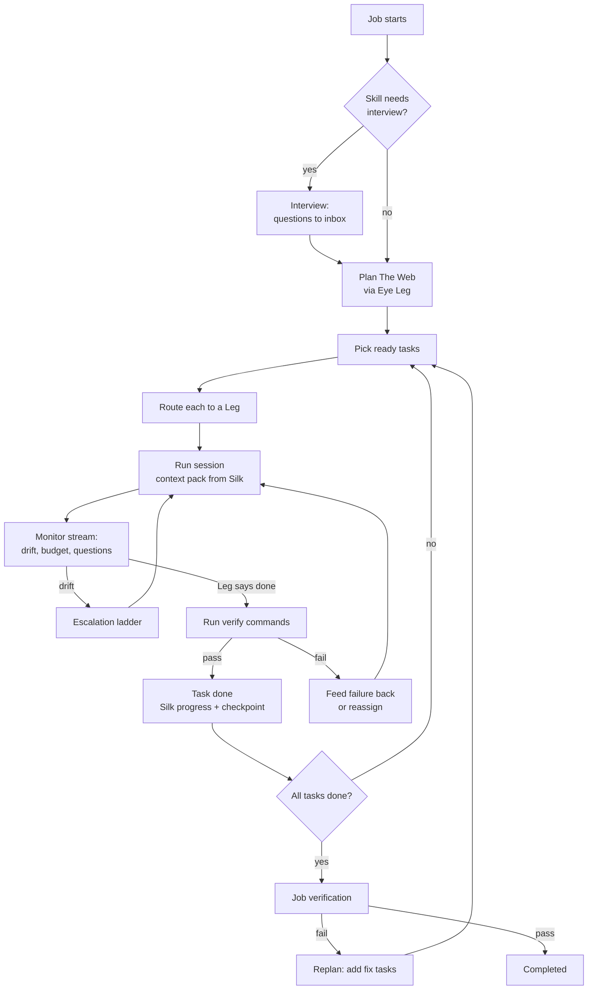

# The Eye

**Is:** the supervisor. It turns a job into The Web, routes each task
to a Leg, watches every session, runs verification, catches drift, and
keeps prompting until the job is completed, blocked or out of budget.
**Is not:** a model. The Eye is deterministic code: a state machine, a
router, a verifier and drift detectors. When it needs judgement
(planning, evaluating, writing a corrective prompt), it borrows a Leg.

## The Eye Leg

At first-run setup Oraknid lists my Legs and asks which one The Eye
should use for reasoning. It recommends the strongest one by capability
profile. I can change it any time in Settings, or per job.

- If the Eye Leg is unavailable (rate-limited, down), The Eye borrows the
  next best Leg that has the `planning` capability, and says so in the
  activity stream.
- Reasoning calls are small and stateless. Each one gets a context
  pack from Silk, never a long conversation (BR-2, BR-3).
- The Eye's reasoning sits behind an `EyeBrain` interface
  ([[ADR-008-Eye-Brain]]). Its calls are of three kinds, each of which
  can have its own model in Settings → The Eye: **planning** (plans,
  replans, interviews), **judging** (reviews, check repairs) and
  **quick** (command checks, my messages, summaries). Unset, a kind uses
  the Eye Leg, then the pool ([[ADR-022-Eye-Decision-Models]]).
- A **shadow planner** can also plan every job, in the background,
  never used: a job (in its project's Work tab) shows its plans beside the ones that ran,
  with their measures and how the real ones fared, so I can judge a
  dedicated decision model (Jev, Kev, a local one) on my own jobs.

## The loop

## Planning

The Eye asks the Eye Leg for a plan as **structured output** (a JSON
Web validated against the contracts schema and The Web's rules: unique
keys, existing dependencies, no cycles, verify commands and relative
scopes). A plan that fails is sent back once with the exact problems. The input is the goal, the
skill, the Silk summary and a workspace digest (tree, key files,
existing tests). The plan has to give every task `scope`, `verify[]`
and `requiredCapabilities`. A task without a verify command is only
accepted for `research` or `plan` kinds, and those are reviewed by a
second reasoning call (`evaluate`) at each turn end: it reads the
Leg's report, what changed and the workspace, and either accepts the
task or sends it back with exactly what is missing, like a failed
check. If no Leg can review it, the task is accepted and the event says
it was not reviewed.

Plans are versioned. A replan never discards done tasks. It adds,
removes or rewrites pending ones, and the change is shown in the UI.

The skill shapes the plan. For the canon-driven skill, the first tasks
are writing the canon, then one phase at a time, matching the skill's
own cycle.

## Routing

For each ready task, The Eye scores every **candidate**: an allowed,
healthy Leg, one of its models, and an effort level
([[ADR-013-Model-Aware-Routing]]). The principle is **the smallest model
that will reliably do the job**. Strong, expensive models are kept for
the work that needs them, and their tight limits are not spent on
mechanical work.

| Factor | Source |
| :-- | :-- |
| Difficulty fit | The task's estimated difficulty (from planning: `low` · `medium` · `high`) vs the model's strength for that capability. A model far above what the task needs is penalised, not just one below it. |
| Capability match | Task `requiredCapabilities` vs the profile's strengths. |
| Past success | Observed success rate on this task kind (per Leg, per project). |
| Remaining quota | For every window that applies (account-wide and per-model): share left, time to reset, and the expected cost of this task in that window (`quotaWeight` × estimated tokens). A scarce window is saved for tasks that need it: when it runs low, its model is reserved for `high` difficulty tasks. |
| Context fit | The task's estimated context vs the Leg's window. |
| Cost | Prefer free or local Legs for `mechanical` tasks. Never pay without a money budget (BR-10). |
| Speed | Observed tokens per second and latency. |
| Known failure patterns | Penalty when the task matches one. |

The highest score wins. The scores and the reason are recorded on the
task, so I can see why a Leg, model and effort were chosen. I can pin
a task to a Leg, or to a Leg model.

**Stepping up and down.** A task that fails verification or drifts on a
cheaper model is retried one step up (a higher effort, then a stronger
model on the same Leg, then another Leg) before the escalation ladder
goes further ([[Drift-Control]]). Success at a lower tier is recorded,
so similar tasks start lower next time. The Eye's own reasoning calls
follow the same rule: planning gets a strong model, while summarising
and classifying get a cheap one.

**Fallback.** When a Leg becomes rate-limited, fails or runs out of
quota mid-task, The Eye writes a handoff to Silk and reassigns the task
to the next-best Leg. When none is left, the job goes `blocked` until
the earliest quota reset, and resumes on its own.

## Self-prompting

After each Leg turn The Eye decides what comes next. It doesn't
wait for me:

- The Leg stopped with work left → continue prompt (built from the
  task, the verify results and Silk).
- The Leg asked a question → The Eye answers from Silk if it can. If
  not, it goes to the inbox and the task waits.
- The Leg claimed done → verify (BR-1).
- Verification failed → a prompt with the exact failing output.

## A check that is wrong

A plan can carry a check that is wrong itself: a misspelled option, a
tool that isn't installed where checks run. The Leg's work can't make
it pass, and sending the Leg after it only burns its time (seen live
2026-10-02: a free model spent twenty minutes on `grep -qx5`).

- The Leg is told the checks are Oraknid's: when one looks wrong, it
  finishes the work and says why, instead of investigating.
- When a check fails the way a broken one does (a program refusing its
  own arguments, exit 2 with its usage; or `not found`, exit 127), The
  Eye looks at it with one reasoning call before the Leg hears of it:
  the task, the check, its output and the Leg's report.
- **Broken**: The Eye replaces it with a corrected check that tests the
  same thing, no less, records the change in Silk as its decision
  (shown on the job), and runs the checks again. At most twice per
  turn end. **Not broken**, or no Leg can think: the failure goes to the
  Leg as usual.

BR-1 holds: a task is still done only when Oraknid's own run of its
checks passes; the change of a check is visible, never silent.

## Talking to The Eye

Each project has one conversation with The Eye, in its Eye tab
([[ADR-034-Projects-First]], 2026-10-03). Its messages carry the
project, and the conversation is the project's messages from every job
that has started, in order; each reply links the job it touched. My
message goes to a job:

1. the newest job of the project still going (running, waiting, paused,
   blocked, queued), as below;
2. else the newest job that has ended, where new work starts a
   follow-up job;
3. else, with no job yet, a new job is made from my message (its goal),
   with the project's skills and budget, and started. If it can't start
   (a tool not set up, no Leg), the reply says why and it waits as a
   draft in New work.

A draft's own conversation (on New work) joins the project's once it
starts. I write in my words: an instruction,
a task to add, context, "stop that", "keep this for later". The Eye
decides what it is (one short reasoning call) and acts, then answers
me in a line:

| It is | The Eye |
| :-- | :-- |
| An instruction for the work now | Records it as my decision in Silk and passes it to every session working on the job at its next turn end, before any check. |
| New work | Adds tasks to The Web (asked again at Supervised). |
| Context | Records a fact or an architecture note in Silk. |
| For later | Keeps it in Silk as a note for later, not acted on now. |
| Stop / pause | Pauses the job at a safe point. |
| A question about the job | Answers from Silk and the job's state. |

New work for a job that has ended starts a **follow-up job** in the
same project, from the ended job's branch, and the reply links to it;
while that follow-up runs, more new work goes to it
([[Jobs-and-Projects]] → Follow-up jobs). If the follow-up can't start,
the message is kept for later and the reply says why. If no Leg
can think (none healthy, or the call fails), my message is kept as my
decision and passed on anyway: my words are never lost. Each message
is kept with its job and its project; the project's Eye tab shows them
all. A message an ended job passed to its follow-up is shown there
once, where the follow-up answered it.

### Questions with options (2026-10-03, [[ADR-037-Questions-With-Options]])

When The Eye needs a choice from me, it asks with options rather than in
prose: a reply in the conversation (and an interview round) carries
**questions**, each `single`, `multi`, `text` or `confirm`, with options
(a label and a line of detail), the one it recommends, and a typed
"Other". I answer them one at a time ([[Web-UI]] → Questions); my
answers go back structured and show as a short list, as my message
answering that reply. A question The Eye's model can't shape stays
`text`; a round written the older way (a question and its options as
words) is upgraded when it is read, so a job resumed mid-interview goes
on. My answers to a reply's questions reach The Eye as my next message;
answers to a question a job waits on (an interview round, a link below)
answer that inbox item, from the conversation or the inbox alike.

## A project's GitHub repo and servers (2026-10-03, [[ADR-038-Project-Accounts]])

Before a task's attempt, The Eye looks at what it needs. A task that
creates a repo, pushes, or opens a pull request on GitHub (its title or
instructions name GitHub or a pull request) needs the project's
**GitHub link**; one that deploys or works on a server needs a server.
When the project has none:

- **GitHub**: The Eye asks once, in the project's conversation, with
  options, and the job waits on the inbox item: which account (only
  when I have several), which repository (a new one named after the
  project, recommended; my five most recently pushed; or one I type as
  `owner/name`, or a new name), and, for a new repo, who can see it
  (public recommended when I asked for public, else private). With one
  account it says it uses that one. With one account and a folder
  whose `origin` already points to one of its repos, there is nothing
  to choose: it links that and says so. With no account, it asks me to
  add one in Settings and asks again once I have.
- **A server**: with one server, it gives it to the project and says
  so; with several, it asks which; with none, it says so once and the
  task goes on.

My answer is saved to the project (its Settings show it) and the task
goes on; The Eye says what it linked. A project made from one of my
GitHub repos is linked to it from the start.

**The work is Oraknid's**: every session of a job gets the built-in
`github` tool ([[ADR-021-Tools-Broker]]): `repo_info`, `create_repo`
(the linked repo, as I chose it, empty), `push` (a local branch, under
its name or another, to the linked repo), `open_pull_request`. The
daemon runs git with the account's token through `GIT_ASKPASS`; the
remote is the URL itself, so nothing is written to the repo's config.
A Leg's context says the project's repo and tells it to use the tool,
never the `gh` CLI, a token of its own or a `git push`. The planner and
The Eye's triage plan GitHub work as the tool's use, with GitHub in the
task's title, never as installing a CLI ([[Approvals-and-Autonomy]] →
Linked work).

## Evaluation

After each task, The Eye records the outcome in the Leg's observed
stats (success, tokens, time, escalations). These feed routing and
update the capability profile (see [[Legs-and-Capability-Profiles]]).

Related: [[Drift-Control]] · [[Silk]] · [[Legs-and-Capability-Profiles]] · [[Budgets-and-Quotas]] · [[ADR-008-Eye-Brain]]
