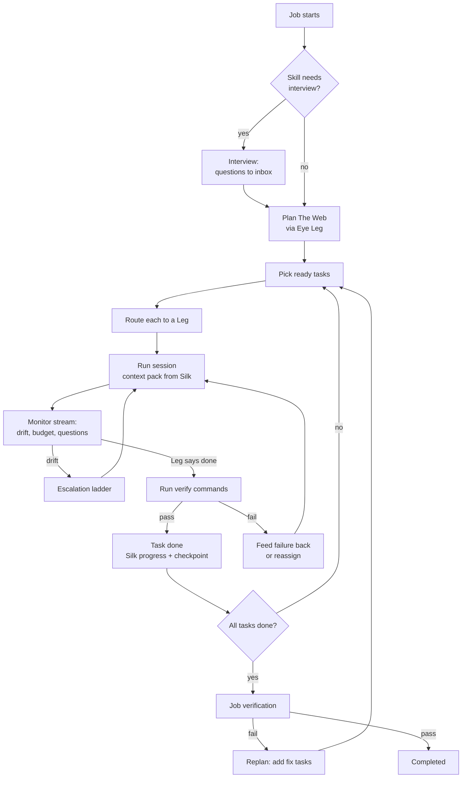

# The Eye

**Is:** the supervisor. It turns a job into The Web, routes each task
to a Leg, watches every session, runs verification, catches drift, and
keeps prompting until the job is completed, blocked or out of budget.
**Is not:** a model. The Eye is deterministic code: a state machine, a
router, a verifier and drift detectors. When it needs judgement
(planning, evaluating, writing a corrective prompt), it borrows a Leg.

## The Eye Leg

At first-run setup Oraknid lists my Legs and asks which one The Eye
should use for reasoning. It recommends the strongest one by capability
profile. I can change it any time in Settings, or per job.

- If the Eye Leg is unavailable (rate-limited, down), The Eye borrows the
  next best Leg that has the `planning` capability, and says so in the
  activity stream.
- Reasoning calls are small and stateless. Each one gets a context
  pack from Silk, never a long conversation (BR-2, BR-3).
- The Eye's reasoning sits behind an `EyeBrain` interface
  ([[ADR-008-Eye-Brain]]). Its calls are of three kinds, each of which
  can have its own model in Settings → The Eye: **planning** (plans,
  replans, interviews), **judging** (reviews, check repairs) and
  **quick** (command checks, my messages, summaries). Unset, a kind uses
  the Eye Leg, then the pool ([[ADR-022-Eye-Decision-Models]]).
- **The Eye's own thinking runs on the strongest model it may use**
  (after the piano job, 2026-10-04). Planning calls (the plan, a replan,
  the interview, new work planned into The Web) and my message while the
  job waits on me or has no plan yet go to my chosen model for that kind,
  else the Eye Leg; with neither, the pool's strongest, not the cheapest
  that fits as tasks are routed: rated for the hardest work first, then
  strongest at planning, then proven on real tasks, quota and health
  breaking ties. An unproven free model never plans while a known strong
  one (Claude Opus or Sonnet, Gemini Pro) is healthy; it does when it is
  all there is.
- A **shadow planner** can also plan every job, in the background,
  never used: the job page shows its plans beside the ones that ran,
  with their measures and how the real ones fared, so I can judge a
  dedicated decision model (Jev, Kev, a local one) on my own jobs.

## The loop

## Planning

The Eye asks the Eye Leg for a plan as **structured output** (a JSON
Web validated against the contracts schema and The Web's rules: unique
keys, existing dependencies, no cycles, verify commands and relative
scopes). A plan that fails is sent back once with the exact problems. The input is the goal, the
skill, the Silk summary and a workspace digest (tree, key files,
existing tests). The plan has to give every task `scope`, `verify[]`
and `requiredCapabilities`. A task without a verify command is only
accepted for `research` or `plan` kinds, and those are reviewed by a
second reasoning call (`evaluate`) at each turn end: it reads the
Leg's report, what changed and the workspace, and either accepts the
task or sends it back with exactly what is missing, like a failed
check. If no Leg can review it, the task is accepted and the event says
it was not reviewed.

**A plan is a graph** (after the piano job, 2026-10-04, when fifteen
tasks, the same ones twice, had no dependency at all). The prompt asks
for one: each task names in `dependsOn` the tasks whose results it
needs: the project's setup before its features, research before the
work that uses it, integration and end-to-end tests after the parts;
tasks that don't need each other run side by side; each piece of work
once; and when I gave phases, each task its `phase`. A plan with the
same work twice, or several tasks and no dependency at all where order
plainly matters (setup, research, integration or tests among them), is
sent back once with the problem said. Before it is stored, Oraknid
shapes it itself (`shapeWeb`): the same work twice is merged into one
task (dependencies, scopes and checks joined); each phase's first tasks
come after the previous phase's last ones; a dependency on a task that
isn't there, on itself or closing a circle is dropped; and, as the last
resort, a plan still without any dependency where order matters is
ordered setup and research, then the work, then integration and tests.
What it mended is said in the plan's Silk entry. The Workflow tab draws
the dependencies.

The planner always plans a job once, whatever came before it: tasks
that didn't come from a plan never stand in for one.

Plans are versioned. A replan never discards done tasks. It adds,
removes or rewrites pending ones, and the change is shown in the UI. A
replan's task that is already in The Web unfinished isn't added again.

The skill shapes the plan. For the canon-driven skill, the first tasks
are writing the canon, then one phase at a time, matching the skill's
own cycle.

## Routing

For each ready task, The Eye scores every **candidate**: an allowed,
healthy Leg, one of its models, and an effort level
([[ADR-013-Model-Aware-Routing]]). The principle is **the smallest model
that will reliably do the job**. Strong, expensive models are kept for
the work that needs them, and their tight limits are not spent on
mechanical work.

| Factor | Source |
| :-- | :-- |
| Difficulty fit | The task's estimated difficulty (from planning: `low` · `medium` · `high`) vs the model's strength for that capability. A model far above what the task needs is penalised, not just one below it. |
| Capability match | Task `requiredCapabilities` vs the profile's strengths. |
| Past success | Trust: the model's prior (a known family, or an unproven free or unknown model) moved by its observed successes on this task kind ([[Legs-and-Capability-Profiles]] → Known and unproven models). |
| Provider failures | A model resting after its provider failed is out; a Leg whose provider just failed gives way ([[Legs-and-Capability-Profiles]] → Provider failures). |
| Remaining quota | For every window that applies (account-wide and per-model): share left, time to reset, and the expected cost of this task in that window (`quotaWeight` × estimated tokens). A scarce window is saved for tasks that need it: when it runs low, its model is reserved for `high` difficulty tasks. |
| Context fit | The task's estimated context vs the Leg's window. |
| Cost | Prefer free or local Legs for `mechanical` tasks. Never pay without a money budget (BR-10). |
| Speed | Observed tokens per second and latency. |
| Known failure patterns | Penalty when the task matches one. |

The highest score wins. The scores and the reason are recorded on the
task, so I can see why a Leg, model and effort were chosen. I can pin
a task to a Leg, or to a Leg model.

**Stepping up and down.** A task that fails verification or drifts on a
cheaper model is retried one step up (a higher effort, then a stronger
model on the same Leg, then another Leg) before the escalation ladder
goes further ([[Drift-Control]]). Success at a lower tier is recorded,
so similar tasks start lower next time. The Eye's own reasoning calls
follow the same rule: planning gets a strong model, while summarising
and classifying get a cheap one.

**Fallback.** When a Leg becomes rate-limited, fails or runs out of
quota mid-task, The Eye writes a handoff to Silk and reassigns the task
to the next-best Leg. When none is left, the job goes `blocked` until
the earliest quota reset, and resumes on its own. A usage limit or a
provider's failure is not the task failing: the attempt isn't counted
against it, and the failing model or Leg rests (M13.22).

## Self-prompting

After each Leg turn The Eye decides what comes next. It doesn't
wait for me:

- The Leg stopped with work left → continue prompt (built from the
  task, the verify results and Silk).
- The Leg asked a question → The Eye answers from Silk if it can. If
  not, it goes to the inbox and the task waits.
- The Leg claimed done → verify (BR-1).
- Verification failed → a prompt with the exact failing output.

## A check that is wrong

A plan can carry a check that is wrong itself: a misspelled option, a
tool that isn't installed where checks run. The Leg's work can't make
it pass, and sending the Leg after it only burns its time (seen live
2026-10-02: a free model spent twenty minutes on `grep -qx5`).

- The Leg is told the checks are Oraknid's: when one looks wrong, it
  finishes the work and says why, instead of investigating.
- When a check fails the way a broken one does (a program refusing its
  own arguments, exit 2 with its usage; or `not found`, exit 127), The
  Eye looks at it with one reasoning call before the Leg hears of it:
  the task, the check, its output and the Leg's report.
- **Broken**: The Eye replaces it with a corrected check that tests the
  same thing, no less, records the change in Silk as its decision
  (shown on the job), and runs the checks again. At most twice per
  turn end. **Not broken**, or no Leg can think: the failure goes to the
  Leg as usual.
- **Checks Oraknid answers itself** (ADR-038): `oraknid github-repo` and
  `oraknid github-branch <branch>`, about the project's linked GitHub
  repo, run by the daemon with the account's token, not in the sandbox.
  The Eye knows the project's repo when it looks at a check, and a check
  that relies on `gh`, a token or a git remote for it is broken.
  A branch check names only branches the repo really has: those the
  task names, else its work branch, never a word guessed from the text;
  an old check naming a branch the repo doesn't have is repaired
  (2026-10-04).

In a project of several repos ([[ADR-042-Several-Repos-And-Servers]]),
both take `--repo <name>` (its name in the project), as
`oraknid github-branch <branch> --repo web`; without it, the project's
only repo, or its only linked one.

BR-1 holds: a task is still done only when Oraknid's own run of its
checks passes; the change of a check is visible, never silent.

## Talking to The Eye

Each job has a prompt to The Eye. I write in my words: an instruction,
a task to add, context, "stop that", "keep this for later". The Eye
decides what it is (one short reasoning call) and acts, then answers
me in a line:

| It is | The Eye |
| :-- | :-- |
| An instruction for the work now | Records it as my decision in Silk and passes it to every session working on the job at its next turn end, before any check. |
| New work | Plans it into The Web: one planning call (`extend`, a planning call) gets The Web as it is and my message, and gives new tasks that depend on the tasks there. The Web's rules and shaping apply; a task already there, done or not, isn't added again, and the same message never adds its tasks twice. A new task that depends on nothing there comes after the work nothing else needs yet. Before the job has a plan (interviewing, planning), new work is kept in Silk as guidance for the plan, never tasks of its own. |
| Context | Records a fact or an architecture note in Silk. |
| For later | Keeps it in Silk as a note for later, not acted on now. |
| Stop / pause | Pauses the job at a safe point. |
| A question about the job | Answers from Silk and the job's state. |

Asking for the work to be merged into the work branch or pushed to
GitHub adds no task: it is the job's ending (Jobs-and-Projects → Ending a
job), done when the job ends, or at once when it has ended, and said in
the reply.

**Talking while a question is open** (after the piano job, 2026-10-04,
when "start now, the interview is over" made tasks and left the round
open for fifteen minutes). When the job waits on me (an interview round,
another question, an approval), the triage is given those items with
their ids and says what my message does to one of them:

| My message | What happens |
| :-- | :-- |
| Answers it, fully or in part | The item is answered with my message, word for word (an approval with the option it chooses), recorded as answered by my message where The Eye asked it; the job goes on. |
| Ends the interview ("enough", "start now", "that's all", "the interview is over") | The round is answered with my words and the interview ends at once: planning starts with what is known. Such words end it without asking any model; with no round open yet, the next round isn't asked. |
| Something else | Handled as usual; the item stays open and the reply ends with one line: "I'm still waiting for your answer to “…”." |

A question is never left blocking a job after I've made myself clear in
the conversation.

New work for a job that has ended is kept for later instead. If no Leg
can think (none healthy, or the call fails), my message is kept as my
decision and passed on anyway: my words are never lost. The
conversation is kept with the job and shown on its page.

### The Eye speaks up ([[ADR-045-The-Eye-Speaks-Up]])

The Eye also writes in the project's conversation on its own, one
message per event and nothing while things go to plan:

| Event | What it says |
| :-- | :-- |
| A task done | One line: the files its commit changed, its checks ("Done: **Write hello.sh** — changed `hello.sh`; its checks pass (`sh hello.sh`)"), the commit beside it. |
| A task left out | The task, why, and the tasks that need it, left out with it; the job goes on without them. Those are not said again one by one. |
| The job done | A short summary of what was built (the only one written by the brain, on the quick model, from the facts; written from them alone when no Leg can think), then its branch and commits, where it was merged and pushed (with a link), and what's left to me: merge it, a check by hand, what wasn't done, what was left out; and a link to the result. |
| Blocked | Why, and what it needs from me (resume after looking at the task, a Leg, the quota reset). The same reason again says nothing. |
| Waiting for me | The question, there too, answerable there (an item's own options become a question saying what each does). Not again when the item already has its message. |
| A request I denied | That the Leg was told, that it tries another way, and that I'm asked if the task can't be done without it. |
| Stopped | That the work so far stays on its branch. |
| The folder put back | What happened to the job's folder and that the task starts again (Jobs-and-Projects → Ending a job). |

They are messages with a report (`action.intent` "report", `action.report`
kind, facts, what's left to me); the page shows them as such (Web-UI).

### Questions that say what each answer does

Every question and approval Oraknid asks gives each answer a line saying
what it does (ADR-037 options with a detail). "\<task\> keeps going wrong"
asks:

| Answer | What happens |
| :-- | :-- |
| **Try again with my advice** (recommended; the advice on its own tab, optional) | My advice is kept in Silk as my decision and the task tries again, its escalation reset. |
| **Give it to another Leg** (only when there is one; one may be picked on its own tab) | The Leg it went wrong on no longer takes the task; the one I picked does, else routing chooses. |
| **I'll do it myself** | The task is mine (its folder named); the job waits until I mark it done or hand it back. |
| **Leave it out** | The task and every task that needs it (listed) are left out; the job goes on. |
| **Stop the job** | The job is cancelled; its work stays on its branch (named). |

It is also asked in the conversation. An item asked before this
(Retry · Take it over · Skip it · Cancel the job) still works: Skip it
leaves out that task alone, as it did.

## A project's repos and servers (2026-10-03)

Before a task's attempt, The Eye makes sure the task has what it needs,
asked once in the project's conversation ([[ADR-038-Project-Accounts]],
[[ADR-042-Several-Repos-And-Servers]]):

- **GitHub** (the task's words name GitHub or a pull request): every repo
  the task is about has a link. In a project of several repos those are
  the repos its scope names when it names some of them, else the ones its
  words name, else all. With one account, a repo whose folder's `origin`
  is one of its repositories is linked to it at once; the others are
  asked in one question set: the account when there are several, a
  repository per repo (a new one named after the project, `site-api` for
  the repo `api` of `site`, recommended; or one of mine; or typed), and
  who can see a new one. A repo that exists keeps the visibility GitHub
  says. Then the task is brought to the links: a note naming each repo's
  link, and its checks that call `gh` or read a remote become Oraknid's
  own, one per repo it is about (`oraknid github-repo --repo api`).
- **A server** (the task deploys, or works on the server, the VPS):
  chosen once per job, kept in the setting `job.server.<job>`.
  - My words name one (the task, the job's goal, or my latest message to
    The Eye about this job, not my answers to its questions): its name
    among the project's servers then all mine, or a role among the
    project's (`production` or `prod`, `staging`, `testing`, or any role
    a server has there). The Eye asks only to confirm: `confirm`, "Deploy
    to production, vps-2?", Yes recommended. No: that one isn't proposed
    again and the options follow.
  - I name none: the project's only server is used and said, unless it
    is production; otherwise The Eye asks with options, the project's
    servers by role (production last, never recommended), then my other
    servers, then **Add a new server** and **Go on without a server**, and
    a role for a server new to the project.
  - **Add a new server** posts a link to Servers → Add a server
    (`/servers?add=1`) and a waiting question (I've added it · Go on
    without a server); the job waits on it. Adding a server answers it
    by itself, and The Eye asks again with the new server recommended.
  - **Production** (a role named so, or a server I marked) is always
    confirmed, even as the project's only server; choosing it from the
    options is my confirmation.
  - My choice is saved to the project with its role (one I named, or
    answered), and the job's sessions are told which server is the job's.

Triage is told the project's repos when there are several and its
servers with their roles, so a deploy task names in its title the server
or role I named.

## Evaluation

After each task, The Eye records the outcome in the Leg's observed
stats (success, tokens, time, escalations). These feed routing and
update the capability profile (see [[Legs-and-Capability-Profiles]]).

Related: [[Drift-Control]] · [[Silk]] · [[Legs-and-Capability-Profiles]] · [[Budgets-and-Quotas]] · [[ADR-008-Eye-Brain]]
