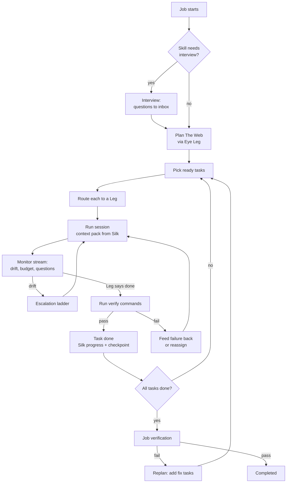

# The Eye

**Is:** the supervisor. It turns a job into The Web, routes each task
to a Leg, watches every session, runs verification, catches drift, and
keeps prompting until the job is completed, blocked or out of budget.
**Is not:** a model. The Eye is deterministic code: a state machine, a
router, a verifier and drift detectors. When it needs judgement
(planning, evaluating, writing a corrective prompt), it borrows a Leg.

## The Eye Leg

At first-run setup Oraknid lists my Legs and asks which one The Eye
should use for reasoning. It recommends the strongest one by capability
profile. I can change it any time in Settings, or per job.

- If the Eye Leg is unavailable (rate-limited, down), The Eye borrows the
  next best Leg that has the `planning` capability, and says so in the
  activity stream.
- Reasoning calls are small and stateless. Each one gets a context
  pack from Silk, never a long conversation (BR-2, BR-3).
- The Eye's reasoning sits behind an `EyeBrain` interface. Dedicated
  decision models (Jev, Kev) plug in there in a later phase
  ([[ADR-008-Eye-Brain]]).

## The loop

## Planning

The Eye asks the Eye Leg for a plan as **structured output** (a JSON
Web validated against the contracts schema and The Web's rules: unique
keys, existing dependencies, no cycles, verify commands and relative
scopes). A plan that fails is sent back once with the exact problems. The input is the goal, the
skill, the Silk summary and a workspace digest (tree, key files,
existing tests). The plan has to give every task `scope`, `verify[]`
and `requiredCapabilities`. A task without a verify command is only
accepted for `research` or `plan` kinds, and those are reviewed by a
second reasoning call (`evaluate`) at each turn end: it reads the
Leg's report, what changed and the workspace, and either accepts the
task or sends it back with exactly what is missing, like a failed
check. If no Leg can review it, the task is accepted and the event says
it was not reviewed.

Plans are versioned. A replan never discards done tasks. It adds,
removes or rewrites pending ones, and the change is shown in the UI.

The skill shapes the plan. For the canon-driven skill, the first tasks
are writing the canon, then one phase at a time, matching the skill's
own cycle.

## Routing

For each ready task, The Eye scores every **candidate**: an allowed,
healthy Leg, one of its models, and an effort level
([[ADR-013-Model-Aware-Routing]]). The principle is **the smallest model
that will reliably do the job**. Strong, expensive models are kept for
the work that needs them, and their tight limits are not spent on
mechanical work.

| Factor | Source |
| :-- | :-- |
| Difficulty fit | The task's estimated difficulty (from planning: `low` · `medium` · `high`) vs the model's strength for that capability. A model far above what the task needs is penalised, not just one below it. |
| Capability match | Task `requiredCapabilities` vs the profile's strengths. |
| Past success | Observed success rate on this task kind (per Leg, per project). |
| Remaining quota | For every window that applies (account-wide and per-model): share left, time to reset, and the expected cost of this task in that window (`quotaWeight` × estimated tokens). A scarce window is saved for tasks that need it: when it runs low, its model is reserved for `high` difficulty tasks. |
| Context fit | The task's estimated context vs the Leg's window. |
| Cost | Prefer free or local Legs for `mechanical` tasks. Never pay without a money budget (BR-10). |
| Speed | Observed tokens per second and latency. |
| Known failure patterns | Penalty when the task matches one. |

The highest score wins. The scores and the reason are recorded on the
task, so I can see why a Leg, model and effort were chosen. I can pin
a task to a Leg, or to a Leg model.

**Stepping up and down.** A task that fails verification or drifts on a
cheaper model is retried one step up (a higher effort, then a stronger
model on the same Leg, then another Leg) before the escalation ladder
goes further ([[Drift-Control]]). Success at a lower tier is recorded,
so similar tasks start lower next time. The Eye's own reasoning calls
follow the same rule: planning gets a strong model, while summarising
and classifying get a cheap one.

**Fallback.** When a Leg becomes rate-limited, fails or runs out of
quota mid-task, The Eye writes a handoff to Silk and reassigns the task
to the next-best Leg. When none is left, the job goes `blocked` until
the earliest quota reset, and resumes on its own.

## Self-prompting

After each Leg turn The Eye decides what comes next. It doesn't
wait for me:

- The Leg stopped with work left → continue prompt (built from the
  task, the verify results and Silk).
- The Leg asked a question → The Eye answers from Silk if it can. If
  not, it goes to the inbox and the task waits.
- The Leg claimed done → verify (BR-1).
- Verification failed → a prompt with the exact failing output.

## Talking to The Eye

Each job has a prompt to The Eye. I write in my words: an instruction,
a task to add, context, "stop that", "keep this for later". The Eye
decides what it is (one short reasoning call) and acts, then answers
me in a line:

| It is | The Eye |
| :-- | :-- |
| An instruction for the work now | Records it as my decision in Silk and passes it to every session working on the job at its next turn end, before any check. |
| New work | Adds tasks to The Web (asked again at Supervised). |
| Context | Records a fact or an architecture note in Silk. |
| For later | Keeps it in Silk as a note for later, not acted on now. |
| Stop / pause | Pauses the job at a safe point. |
| A question about the job | Answers from Silk and the job's state. |

New work for a job that has ended is kept for later instead. If no Leg
can think (none healthy, or the call fails), my message is kept as my
decision and passed on anyway: my words are never lost. The
conversation is kept with the job and shown on its page.

## Evaluation

After each task, The Eye records the outcome in the Leg's observed
stats (success, tokens, time, escalations). These feed routing and
update the capability profile (see [[Legs-and-Capability-Profiles]]).

Related: [[Drift-Control]] · [[Silk]] · [[Legs-and-Capability-Profiles]] · [[Budgets-and-Quotas]] · [[ADR-008-Eye-Brain]]
