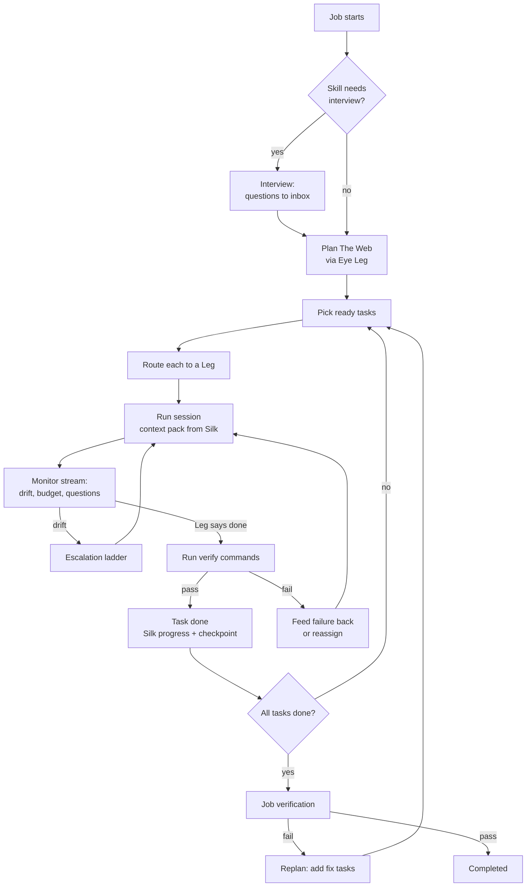

# The Eye

**Is:** the supervisor. It turns a job into The Web, routes each task
to a Leg, watches every session, runs verification, catches drift, and
keeps prompting until the job is completed, blocked or out of budget.
**Is not:** a model. The Eye is deterministic code: a state machine, a
router, a verifier and drift detectors. When it needs judgement
(planning, evaluating, writing a corrective prompt), it borrows a Leg.

## The Eye Leg

At first-run setup Oraknid lists my Legs and asks which one The Eye
should use for reasoning. It recommends the strongest one by capability
profile. I can change it any time in Settings, or per job.

- If the Eye Leg is unavailable (rate-limited, down), The Eye borrows the
  next best Leg that has the `planning` capability, and says so in the
  activity stream.
- Reasoning calls are small and stateless. Each one gets a context
  pack from Silk, never a long conversation (BR-2, BR-3).
- The Eye's reasoning sits behind an `EyeBrain` interface
  ([[ADR-008-Eye-Brain]]). Its calls are of three kinds, each of which
  can have its own model in Settings → The Eye: **planning** (plans,
  replans, interviews), **judging** (reviews, check repairs) and
  **quick** (command checks, my messages, summaries). Unset, a kind uses
  the Eye Leg, then the pool ([[ADR-022-Eye-Decision-Models]]).
- **The Eye's own thinking runs on the strongest model it may use**
  (after the piano job, 2026-10-04). Planning calls (the plan, a replan,
  the interview, new work planned into The Web) and my message while the
  job waits on me or has no plan yet go to my chosen model for that kind,
  else the Eye Leg; with neither, the pool's strongest, not the cheapest
  that fits as tasks are routed: rated for the hardest work first, then
  strongest at planning, then proven on real tasks, quota and health
  breaking ties. An unproven free model never plans while a known strong
  one (Claude Opus or Sonnet, Gemini Pro) is healthy; it does when it is
  all there is. Since M15.3 (ADR-052 §5) its **judging** calls too (a
  check repaired, a review of a result) run on the strongest model it may
  use, a known family before an unproven one at the same level, never on
  a model resting after its provider failed.
- A **shadow planner** can also plan every job, in the background,
  never used: the job page shows its plans beside the ones that ran,
  with their measures and how the real ones fared, so I can judge a
  dedicated decision model (Jev, Kev, a local one) on my own jobs.

## The loop

## Planning

The Eye asks the Eye Leg for a plan as **structured output** (a JSON
Web validated against the contracts schema and The Web's rules: unique
keys, existing dependencies, no cycles, verify commands and relative
scopes). A plan that fails is sent back once with the exact problems. The input is the goal, the
skill, the Silk summary and a workspace digest (tree, key files,
existing tests). The plan has to give every task `scope`, `verify[]`
and `requiredCapabilities`. A task without a verify command is only
accepted for `research` or `plan` kinds, and those are reviewed by a
second reasoning call (`evaluate`) at each turn end: it reads the
Leg's report, what changed and the workspace, and either accepts the
task or sends it back with exactly what is missing, like a failed
check. If no Leg can review it, the task is accepted and the event says
it was not reviewed.

**A plan is a graph** (after the piano job, 2026-10-04, when fifteen
tasks, the same ones twice, had no dependency at all). The prompt asks
for one: each task names in `dependsOn` the tasks whose results it
needs: the project's setup before its features, research before the
work that uses it, integration and end-to-end tests after the parts;
tasks that don't need each other run side by side (at once, by
default, as the computer and the Legs admit: [[ADR-050-Parallel-By-Default]]); each piece of work
once; and when I gave phases, each task its `phase`. A plan with the
same work twice, or several tasks and no dependency at all where order
plainly matters (setup, research, integration or tests among them), is
sent back once with the problem said. Before it is stored, Oraknid
shapes it itself (`shapeWeb`): the same work twice is merged into one
task (dependencies, scopes and checks joined); each phase's first tasks
come after the previous phase's last ones; a dependency on a task that
isn't there, on itself or closing a circle is dropped; and, as the last
resort, a plan still without any dependency where order matters is
ordered setup and research, then the work, then integration and tests.
What it mended is said in the plan's Silk entry. The Workflow tab draws
the dependencies.

The planner always plans a job once, whatever came before it: tasks
that didn't come from a plan never stand in for one.

**Whole goals, not crumbs** (M15.3, ADR-052 §1, after the misahaty job of
2026-10-06, when one `docker compose down` became eight tasks). The
planner is told, with examples, that a goal one agent can do in one
session is one task, which the agent plans itself; it splits only where
pieces are substantial and truly independent, and ends each task's
instructions with its acceptance criteria. Its checks are few and
meaningful, written to parse in POSIX sh. `shapeWeb` merges what is left
of a plan of crumbs (`mergeCrumbs`): three or more small tasks (not rated
high), each the only one after the one before and needing nothing else,
on the same place (scopes that can meet, or only notes) and in the same
phase, become one task, its steps numbered in order, scopes, checks and
capabilities joined; said in the plan's Silk entry.

**One interview round for a complete spec** (M15.3): a goal that reads as
a complete spec (`specComplete`: a long text, a list of six features or
more, or sections) is interviewed in one round at most, told to ask only
what the spec truly leaves open.

Plans are versioned. A replan never discards done tasks. It adds,
removes or rewrites pending ones, and the change is shown in the UI. A
replan's task that is already in The Web unfinished isn't added again.

The skill shapes the plan. For the canon-driven skill, the first tasks
are writing the canon, then one phase at a time, matching the skill's
own cycle.

## Routing

For each ready task, The Eye scores every **candidate**: an allowed,
healthy Leg, one of its models, and an effort level
([[ADR-013-Model-Aware-Routing]]). The principle is **the smallest model
that will reliably do the job**. Strong, expensive models are kept for
the work that needs them, and their tight limits are not spent on
mechanical work.

| Factor | Source |
| :-- | :-- |
| Difficulty fit | The task's estimated difficulty (from planning: `low` · `medium` · `high`) vs the model's strength for that capability. A model far above what the task needs is penalised, not just one below it. |
| Capability match | Task `requiredCapabilities` vs the profile's strengths. |
| Past success | Trust: the model's prior (a known family, or an unproven free or unknown model) moved by its observed successes on this task kind ([[Legs-and-Capability-Profiles]] → Known and unproven models). |
| Provider failures | A model resting after its provider failed is out; a Leg whose provider just failed gives way ([[Legs-and-Capability-Profiles]] → Provider failures). |
| Remaining quota | For every window that applies (account-wide and per-model): share left, time to reset, and the expected cost of this task in that window (`quotaWeight` × estimated tokens). A scarce window is saved for tasks that need it: when it runs low, its model is reserved for `high` difficulty tasks. |
| Context fit | The task's estimated context vs the Leg's window. |
| Cost | Prefer free or local Legs for `mechanical` tasks. Never pay without a money budget (BR-10). |
| Speed | Observed tokens per second and latency. |
| Known failure patterns | Penalty when the task matches one. |

The highest score wins. The scores and the reason are recorded on the
task, so I can see why a Leg, model and effort were chosen. I can pin
a task to a Leg, or to a Leg model.

**The ladder** (M15.3, [[ADR-052-A-Harness-For-Any-Model]] §3). Every
model has a rung per kind of work (code, server, research, docs, review,
planning: [[Legs-and-Capability-Profiles]] → The ladder). A task starts on
the cheapest model likely to do it; when the agent ends its turn and the
work isn't done (its checks fail, the review says it's wrong), **one
failure moves it up at once**: the session hands over (what was tried,
what failed, in Silk), the model is recorded as having failed that kind
of work, and the next attempt goes only to a model on a higher rung
(`task.climbing`), whose first message says what the one before didn't
get done. At the top, the strongest allowed model takes it again and
corrects in its own session; the drift ladder ([[Drift-Control]]) runs
there. A broken check, the machine, a network error, a quota or a pause
never counts against a model. A job's **Claude share** caps how much of
it runs on Claude when it climbs.

**Retries resume the session** (ADR-052 §1). When the same model takes a
task up again (after a pause or a restart, a step up in effort, the top
of the ladder), its own native session is resumed (Claude Code's
`--resume`, OpenCode's session, Antigravity's conversation) with why it
stopped, never after its work was rolled back. A model taking over from
another starts fresh, with the handoff.

**Stepping up and down.** Drift on a model is retried one step up (a
higher effort, then a stronger model on the same Leg, then another Leg)
before the escalation ladder goes further ([[Drift-Control]]). Success at a lower tier is recorded,
so similar tasks start lower next time. The Eye's own reasoning calls
follow the same rule: planning gets a strong model, while summarising
and classifying get a cheap one.

**Drift is confirmed before it is acted on** ([[ADR-056-The-Harness]] →
Monitors suspect, a model confirms; [[Drift-Control]]). What the drift
monitors catch is a suspicion. What the project's tools write by
themselves (its ecosystems' by-products, its ignore rules, what was
learned for it) never is. A suspicion the ladder would act on goes to
The Eye's **drift judge** first, a quick call (`judgeDrift`, the quick
model, then the strongest allowed on "drift" or "unsure"), which sees the
task, the suspicion, what the agent ran and its last words: "expected"
drops it, "drift" goes to the ladder, "unsure" asks the agent once in
its session and the judge decides on its answer. By-products it names
are learned for the project. None of this reaches me: no message,
question or notification, only the attempt log; a forbidden action or a
refused one tried again still acts at once, and a judge that fails only
corrects.

**Fallback.** When a Leg becomes rate-limited, fails or runs out of
quota mid-task, The Eye writes a handoff to Silk and reassigns the task
to the next-best Leg. When none is left, the job goes `blocked` until
the earliest quota reset, and resumes on its own. An agent that can't
work (out of quota until the reset its own words give, paused, failing
to start, on a deprecated model) is never routed to (M15.1,
[[Legs-and-Capability-Profiles]] → Unusable agents), and a blocked job
says per Leg the real reason and what to do ("Claude A is paused in
Oraknid: unpause it on its card (Legs) to go on"), never "out of quota"
for a Leg that is paused. A usage limit or a
provider's failure is not the task failing: the attempt isn't counted
against it, and the failing model or Leg rests (M13.22).

## Self-prompting

After each Leg turn The Eye decides what comes next. It doesn't
wait for me:

- The Leg stopped with work left → continue prompt (built from the
  task, the verify results and Silk).
- The Leg asked a question → The Eye answers from Silk if it can. If
  not, it goes to the inbox and the task waits.
- The Leg claimed done → verify (BR-1).
- Verification failed → a prompt with the exact failing output.

## A check that is wrong

A plan can carry a check that is wrong itself: a misspelled option, a
tool that isn't installed where checks run. The Leg's work can't make
it pass, and sending the Leg after it only burns its time (seen live
2026-10-02: a free model spent twenty minutes on `grep -qx5`).

- **Checks in the loop** (M15.3, ADR-052 §2): the agent gets the goal,
  the task's acceptance criteria (the end of its instructions) and its
  checks, and runs them itself until they pass. For Claude Code they are
  also a Stop hook, in process through the Agent SDK: while a check fails
  (and doesn't look broken) its turn can't end, three times at most per
  turn (`task.checks-held`). Other Legs have the prompt only. Oraknid
  runs the checks again after (BR-1).
- **Tested before they judge** (M15.1): each check runs once in the
  task's folder before its first attempt (three minutes at most each).
  Failing on work not done yet is what it should do; one that looks
  broken (a syntax or quoting error, `[: too many arguments`, a tool not
  installed, a program refusing its arguments: `brokenCheckHint`) is
  repaired now, before any agent can be failed by it. What the run left
  in the folder is put back; `task.checks-tried` lists each check's state.
- The Leg is told the checks are Oraknid's: when one looks wrong, it
  finishes the work and says why, instead of investigating. **An agent
  that shows a check is broken** ("check #1 fails due to a quoting issue",
  `saysCheckBroken`) gets that check reviewed, not a failed attempt.
- When a check fails the way a broken one does (a program refusing its
  own arguments, exit 2 with its usage; or `not found`, exit 127), The
  Eye looks at it with one reasoning call before the Leg hears of it:
  the task, the check, its output and the Leg's report.
- **Broken**: The Eye replaces it with a corrected check that tests the
  same thing, no less, records the change in Silk as its decision
  (shown on the job), and runs the checks again. At most twice per
  turn end. **Not broken**, or no Leg can think: the failure goes to the
  Leg as usual.
- **Checks Oraknid answers itself** (ADR-038): `oraknid github-repo` and
  `oraknid github-branch <branch>`, about the project's linked GitHub
  repo, run by the daemon with the account's token, not in the sandbox.
  The Eye knows the project's repo when it looks at a check, and a check
  that relies on `gh`, a token or a git remote for it is broken.
  A branch check names only branches the repo really has: those the
  task names, else its work branch, never a word guessed from the text;
  an old check naming a branch the repo doesn't have is repaired
  (2026-10-04).
- **CI passed** (2026-10-07, [[ADR-058-CI-In-Oraknid]]): `oraknid
  github-ci [<branch>|--branch <b>] [--repo <name>] [--timeout <minutes>]`
  waits for the GitHub Actions runs of the branch's commit here (pushed
  by the job's end steps; else its latest on GitHub) and passes when
  every one passed. It fails with the failing workflow, job and step and
  that step's last 40 lines, when they still run at the timeout (20
  minutes, 60 at most), when no run came for the commit, or at once when
  the repository has no workflows. The branch defaults to the
  repository's default branch. Like the other two it runs after the end
  steps; stopping the job stops the wait.

In a project of several repos ([[ADR-042-Several-Repos-And-Servers]]),
all three take `--repo <name>` (its name in the project), as
`oraknid github-branch <branch> --repo web`; without it, the project's
only repo, or its only linked one.

- **Checks on a server** (2026-10-07, [[ADR-049-Server-Chat-And-Server-Jobs]]):
  written `ssh <alias> <command>`, the alias alone; one that carries the
  agent's own ssh setup (`HOME=…`, `-F <its config>`, `-o …`) is put in
  that plain form before the work, and Oraknid runs it over its own
  connection; one that wraps its ssh in local shell (`n=$(ssh <alias>
  docker ps -q | wc -l); [ "$n" -ge 2 ]`) runs whole on the server. A
  check that can't set up (ssh can't open its config or key, resolve or
  reach its host; "No such file or directory" on Oraknid's own paths)
  looks broken and is repaired, never charged to the agent.
- **Guard checks** (what the work must keep true, marked `# guard`) pass
  before the work too: one that fails then is wrong and is repaired from
  the state its output shows, "still running" by name rather than an
  exact count.

BR-1 holds: a task is still done only when Oraknid's own run of its
checks passes; the change of a check is visible, never silent. A check
that passes only thanks to files the agent made outside its task after
the check failed, files the check names, fails (ADR-052 §2 → Not
another way; the Verifier's rule, wired with the harness's stage 4).

## What the agent needs of me (2026-10-07)

An agent can end its turn with a failed check because something only I
can do or allow stands in its way: "The check is right and the fix is
blocked by a guardrail that only the owner can lift… Owner action
required: rm -rf /root/misahaty". The Eye reads its last message
(`saysOwnerNeeded`) and asks me that, before the ladder or "keeps going
wrong": the command it was blocked on (the blocked one it names, else
the last blocked, else the one its words give), why, the failing check,
and **Allow** (that exact command runs once and the agent is told to go
on) · **I'll do it** (the task is mine) · **Leave it out** · **Stop the
job**. My own words instead go to the agent. Asked once per command in
an attempt; in the inbox and the conversation.

## Talking to The Eye

Each job has a prompt to The Eye. I write in my words: an instruction,
a task to add, context, "stop that", "keep this for later". The Eye
decides what it is (one short reasoning call) and acts, then answers
me in a line:

| It is | The Eye |
| :-- | :-- |
| An instruction for the work now | Records it as my decision in Silk and passes it to every session working on the job at its next turn end, before any check. |
| New work | Plans it into The Web: one planning call (`extend`, a planning call) gets The Web as it is and my message, and gives new tasks that depend on the tasks there. The Web's rules and shaping apply; a task already there, done or not, isn't added again, and the same message never adds its tasks twice. A new task that depends on nothing there comes after the work nothing else needs yet. Before the job has a plan (interviewing, planning), new work is kept in Silk as guidance for the plan, never tasks of its own. |
| Context | Records a fact or an architecture note in Silk. |
| For later | Keeps it in Silk as a note for later, not acted on now. |
| Stop / pause | Pauses the job at a safe point. |
| A question about the job | Answers from Silk and the job's state. |

Asking for the work to be merged into the work branch or pushed to
GitHub adds no task: it is the job's ending (Jobs-and-Projects → Ending a
job), done when the job ends, or at once when it has ended, and said in
the reply.

**Talking while a question is open** (after the piano job, 2026-10-04,
when "start now, the interview is over" made tasks and left the round
open for fifteen minutes). When the job waits on me (an interview round,
another question, an approval), the triage is given those items with
their ids and says what my message does to one of them:

| My message | What happens |
| :-- | :-- |
| Answers it, fully or in part | The item is answered with my message, word for word (an approval with the option it chooses), recorded as answered by my message where The Eye asked it; the job goes on. |
| Ends the interview ("enough", "start now", "that's all", "the interview is over") | The round is answered with my words and the interview ends at once: planning starts with what is known. Such words end it without asking any model; with no round open yet, the next round isn't asked. |
| Something else | Handled as usual; the item stays open and the reply ends with one line: "I'm still waiting for your answer to “…”." |

A question is never left blocking a job after I've made myself clear in
the conversation.

New work for a job that has ended is kept for later instead. If no Leg
can think (none healthy, or the call fails), my message is kept as my
decision and passed on anyway: my words are never lost. The
conversation is kept with the job and shown on its page.

What the triage is given, besides the job: the **recent jobs of this
conversation** (its project's, newest first, five), each with its title,
how it stands or ended and why ("cancelled: Cancelled from the chat",
"blocked: …") and its description; in a server's chat, the server's
**state document** too (its first 6000 characters).

### Resolving what it doesn't know (2026-10-07)

After the piano chat of 2026-10-07: I wrote "start another job to stop
and remove misahaty related container and data" in the piano project,
and The Eye asked what misahaty was, though misahaty is a compose
project in the state document of the server spinet-staging, and a job
"Back up and remove misahaty compose project" had been cancelled in that
server's chat the same day.

Before the triage, the **names** of my message (words that name
something: not everyday English or the everyday words of software work —
"container", "data", "remove", "job" are none) are looked up across
Oraknid, locally, with no model:

| Where | Counts |
| :-- | :-- |
| A server's or project's name | most |
| A server's state document (its newest version) or my description of it | much |
| A job's title or goal (in another project, or in a server's chat) | some |
| What a project's jobs learned (Silk) | a little |
| What was said in another conversation | least, and never enough alone |

A name the project knows itself (its name, its jobs' titles and goals,
its Silk, the servers it uses and their state documents) is no
question; what was only said in its conversation doesn't count as
known. A name found in more than three places names nothing in
particular and is left out. A server's own project counts as the
server.

The places found are given to the triage with their keys
(`server:<id>`, `project:<id>`) and what was found in each; the triage
says in `place` where the work belongs, `here` or one of those. Then:

- **The triage names a place**: my request is taken there.
- **It would ask me what something is** (it asks questions, or it
  answers that it doesn't know or needs clarification) and one place
  clearly leads (at least twice the next one's weight): taken there,
  without asking.
- **Several places are as likely** (within half of the first): The Eye
  asks **"Which one is this about?"** with those places as options and
  **Here, in <project>** last ([[ADR-037-Questions-With-Options]]). My
  answer takes my request there, no model asked again; "here" has The
  Eye read it here, nothing looked up again.
- **Nothing found**: the triage's reply as it is; asking stays the
  right thing.

When the triage acts on my message here (an instruction, new work it
understood), nothing is taken anywhere, so a name a project has only in
common with another place never moves work out of it.

**Taken where?** To a server: my request goes into the **server's chat**
(through the server, as if I had written it there): to the job going on
it, else read by the server's Eye (`serverTalk`), which starts a server
job with its plan approval as usual; its reply says "You asked in
piano's chat; I brought it here." To another project: into its
conversation, read there as any message. Where I wrote it, The Eye says
in a line where it found the name and that it took it there, with links
to that chat and the job it started: "**misahaty** runs on
spinet-staging (its state document; the job “Back up and remove
misahaty compose project” was cancelled there). I've taken this to
spinet-staging's chat, where it is the job “…”: it tells you what it
will change on spinet-staging before anything does." A request is taken
once: where it lands, nothing is looked up again.

**"Another job", "again", "retry".** My message refers back to an
earlier job of the conversation (it ended, failed, is blocked or paused)
when it says "another job", "another try", "again", "retry", "redo",
"once more": the earlier job is the newest of them that shares a name
with my message, or, for "again"/"retry" alone, the newest. The new job
(a follow-up in a project, a server job in a server's chat) gets in its
goal "This is another try at an earlier job, “…” (cancelled: …)", that
job's goal, what it learned (its Silk: facts, issues, decisions,
progress) and The Eye's last report of it. "Start another job to add
dark mode", sharing no name with an earlier job, is new work.

### Cancelling from the chat (2026-10-07)

The conversation has a **Cancel** control in its header, there whenever
a job of the conversation hasn't ended (running, planning, waiting for a
question or an approval, blocked, paused): "Cancel “<title>”? The work
so far stays in its folder." With several going, a small menu picks
which first. It is `jobs.cancel` (reason "Cancelled from the chat."):
the job stops at a safe point; every question and approval it had open
is withdrawn (Audit 1 → Q1-12), so the inbox holds none of them and the
conversation shows them as no longer asked; The Eye's line in the
conversation says it ("The job is stopped: Cancelled from the chat. The
work so far stays in its folder."). The same in a server's chat, and in
the terminal app's `/cancel` ([[Terminal-App]]).

### Thinking out loud (2026-10-04, M13.25)

The conversation never sits silent while The Eye thinks or the agents
work. Each reasoning call of a job (the interview, the plan, a replan,
new work planned into The Web, reading my message, a review, a check
looked at, the method chosen, a command judged, the summary, the name)
is shown in it as it runs: what it is doing in words ("Planning the
work…", "Reading your answer…"), its model, the time so far, and what
the model writes as it comes — its reasoning where the Leg streams it
(Claude Code's thinking), its text, the files it reads. When it ends it
folds to one line saying what came of it ("Planned 9 tasks in 41 s ·
Claude · Opus"), which opens again to what it thought. A shadow plan
(ADR-022) is never shown.

A thought is the call's Leg session: what it wrote is the session's log
(`sessions.log`), streamed as `session.text` and `session.thinking`
(coalesced, four a second) on the job's topic; `eye.thinking.started`
and `eye.thinking.ended` say when it starts and what it came to
(`EyeThought`: call, purpose, model, times, outcome, summary). The list
(`projects.thinking`, `jobs.thinking`) comes from the job's Eye
sessions, so a call from before a restart is there, a call cut by a
crash said as such. The agents at work show as a compact line per
running task: its title, its last tool or line, its model, its time.

**Stepping in.** While The Eye thinks I can:

| I | What happens |
| :-- | :-- |
| Press **Stop** | The call ends now (its Leg session is ended). A call of the job's own steps (the plan, a replan, the interview, a review, a check looked at, the method chosen) pauses the job first: the call isn't recorded, so on resume it is thought again, with anything I said meanwhile. Reading my message just ends; nothing is kept from it. Said in one line. |
| Write a message that corrects it ("no, use Postgres", "that's wrong", "actually, one page") | **Stop and redo with this**: the call's session is ended and the call runs again with my words in its prompt, which win where they differ from the rest; my words are kept as my decision in Silk ("My correction: …") and passed to the agents working now. One line says so; the message isn't read again as a new one. |
| Write anything else ("also add dark mode") | **Add as context**: nothing is stopped; my message is read as usual (the triage above), and it is added to the job's next call that plans or judges (and to a retry of the one running). |

Which one a message does is chosen from its words (`correctsThinking`,
packages/core: a message that starts by correcting — "no", "wait",
"actually", "don't", "that's wrong" — or says "instead of", "use X
instead", "I meant"), shown before I send it, and mine to change. Only
The Eye's own thinking can be stopped or redone, never a quick judgement
in passing (a command judged, a name). A crash during a redo loses
nothing: the call is a step not yet recorded, so it runs again, and my
correction is in Silk; a message whose reading was stopped to think
again is read again after a restart.

### The Eye speaks up ([[ADR-045-The-Eye-Speaks-Up]])

The Eye also writes in the project's conversation on its own, one
message per event and nothing while things go to plan:

| Event | What it says |
| :-- | :-- |
| A task done | One line: the files its commit changed, its checks ("Done: **Write hello.sh** — changed `hello.sh`; its checks pass (`sh hello.sh`)"), the commit beside it. |
| A task left out | The task, why, and the tasks that need it, left out with it; the job goes on without them. Those are not said again one by one. |
| The job done | A short summary of what was built (the only one written by the brain, on the quick model, from the facts; written from them alone when no Leg can think), then its branch and commits, where it was merged and pushed (with a link), and what's left to me: merge it, a check by hand, what wasn't done, what was left out; and a link to the result. |
| Blocked | Why, and what it needs from me (resume after looking at the task, a Leg, the quota reset). The same reason again says nothing. |
| Waiting for me | The question, there too, answerable there (an item's own options become a question saying what each does). Not again when the item already has its message. |
| A request I denied | That the Leg was told, that it tries another way, and that I'm asked if the task can't be done without it. |
| Stopped | That the work so far stays on its branch. |
| The folder put back | What happened to the job's folder and that the task starts again (Jobs-and-Projects → Ending a job). |

They are messages with a report (`action.intent` "report", `action.report`
kind, facts, what's left to me); the page shows them as such (Web-UI).

### Questions that say what each answer does

Every question and approval Oraknid asks gives each answer a line saying
what it does (ADR-037 options with a detail). "\<task\> keeps going wrong"
asks:

| Answer | What happens |
| :-- | :-- |
| **Try again with my advice** (recommended; the advice on its own tab, optional) | My advice is kept in Silk as my decision and the task tries again, its escalation reset. |
| **Give it to another Leg** (only when there is one; one may be picked on its own tab) | The Leg it went wrong on no longer takes the task; the one I picked does, else routing chooses. |
| **I'll do it myself** | The task is mine (its folder named); the job waits until I mark it done or hand it back. |
| **Leave it out** | The task and every task that needs it (listed) are left out; the job goes on. |
| **Stop the job** | The job is cancelled; its work stays on its branch (named). |

It is also asked in the conversation. An item asked before this
(Retry · Take it over · Skip it · Cancel the job) still works: Skip it
leaves out that task alone, as it did.

## A project's repos and servers (2026-10-03)

Before a task's attempt, The Eye makes sure the task has what it needs,
asked once in the project's conversation ([[ADR-038-Project-Accounts]],
[[ADR-042-Several-Repos-And-Servers]]):

- **GitHub** (the task's words name GitHub or a pull request): every repo
  the task is about has a link. In a project of several repos those are
  the repos its scope names when it names some of them, else the ones its
  words name, else all. With one account, a repo whose folder's `origin`
  is one of its repositories is linked to it at once; the others are
  asked in one question set: the account when there are several, a
  repository per repo (a new one named after the project, `site-api` for
  the repo `api` of `site`, recommended; or one of mine; or typed), and
  who can see a new one. A repo that exists keeps the visibility GitHub
  says. Then the task is brought to the links: a note naming each repo's
  link, and its checks that call `gh` or read a remote become Oraknid's
  own, one per repo it is about (`oraknid github-repo --repo api`).
- **A server** (the task deploys, or works on the server, the VPS):
  chosen once per job, kept in the setting `job.server.<job>`.
  - My words name one (the task, the job's goal, or my latest message to
    The Eye about this job, not my answers to its questions): its name
    among the project's servers then all mine, or a role among the
    project's (`production` or `prod`, `staging`, `testing`, or any role
    a server has there). The Eye asks only to confirm: `confirm`, "Deploy
    to production, vps-2?", Yes recommended. No: that one isn't proposed
    again and the options follow.
  - I name none: the project's only server is used and said, unless it
    is production; otherwise The Eye asks with options, the project's
    servers by role (production last, never recommended), then my other
    servers, then **Add a new server** and **Go on without a server**, and
    a role for a server new to the project.
  - **Add a new server** posts a link to Servers → Add a server
    (`/servers?add=1`) and a waiting question (I've added it · Go on
    without a server); the job waits on it. Adding a server answers it
    by itself, and The Eye asks again with the new server recommended.
  - **Production** (a role named so, or a server I marked) is always
    confirmed, even as the project's only server; choosing it from the
    options is my confirmation.
  - My choice is saved to the project with its role (one I named, or
    answered), and the job's sessions are told which server is the job's.

Triage is told the project's repos when there are several and its
servers with their roles, so a deploy task names in its title the server
or role I named.

## A server's conversation (2026-10-04, [[ADR-049-Server-Chat-And-Server-Jobs]])

Each server has a conversation with The Eye, its page's **Chat** tab:
the conversation of the server's own project, hidden from the Projects
list. With a job going on the server, my message goes to it as in a
project (Talking to The Eye). With none, one call on the quick model
(`serverTalk`) reads my message with the server's state document,
oraknid-monitor's last reading and what runs there:

- a **question** they answer is answered in the conversation, with no
  job ("Answered from the state document"); what they don't show is
  said, never guessed;
- **work**, or a question that needs looking on the server, starts a
  **server job** in the server's project: its goal my request made
  precise, the server already its server (nothing asked), the
  **server-work** method, no interview. The Eye says so in one line, and
  that it will say what changes before anything does.

`serverTalk` is also given the server's recent jobs (how each ended and
why) and what the names of my message match elsewhere in Oraknid
(Resolving what it doesn't know, above); "again" or "start another job"
after a job that was cancelled there carries that job's goal and what it
learned into the new one.

A server job is planned like any job, told that its place is the server
(`ssh <alias> …`), with the state document; a small job is one task, a
task that only looks is research. Its checks on the server are written
`ssh <alias> <command that reads>` and run by Oraknid itself over its
own connection. Before work starts, a plan that changes the server waits
for my approval, **"Approve what will change on <server>"**, listing
each task and what it may change, unless the job is at Full autonomy on
a server that isn't production; each new version of the plan asks again.
Production asks before any change it makes on the server, at any
autonomy ([[Servers]] → A server's chat and its jobs).

When it ends, The Eye's report of the job (The Eye speaks up) says what
was done, the state document's new version with its diff from the one
before, and the server's backup plans to look at when its data changed.

## Evaluation

After each task, The Eye records the outcome in the Leg's observed
stats (success, tokens, time, escalations). These feed routing and
update the capability profile (see [[Legs-and-Capability-Profiles]]).

Related: [[Drift-Control]] · [[Silk]] · [[Legs-and-Capability-Profiles]] · [[Budgets-and-Quotas]] · [[ADR-008-Eye-Brain]]
