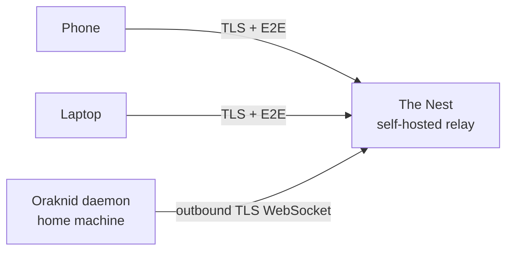

# The Nest *(draft — Phase 4)*

**Is:** a relay server I host myself, so I can reach my Oraknid from
anywhere (phone or desktop) without opening ports at home.
**Is not:** a cloud service run by anyone else, or a place where my job
data is stored.

## What I know now

- The daemon connects **outbound** to The Nest over a WebSocket (TLS).
  No port forwarding is needed.
- My devices connect to The Nest. It relays their requests to the daemon
  and the daemon's live updates back to them.
- **End-to-end encryption between device and daemon:** The Nest relays
  ciphertext and can't read jobs, Silk or approvals. Pairing exchanges
  keys between the device and the daemon. The Nest only knows device
  and daemon identities.
- Device pairing reuses the daemon's pairing ([[Security]]). A device
  paired locally can use The Nest without pairing again.
- Web push to my phone works through The Nest.

## Open questions (decide later)

- Hosting: a small VPS with Docker Compose is the working assumption.
  The deploy shape is to be decided in Phase 4.
- The E2E protocol: an existing one (e.g. Noise) or TLS-in-tunnel. Needs
  an ADR.
- Serving the web UI to remote devices: from The Nest (static) or
  relayed from the daemon.
- Several daemons per Nest (e.g. home and work machines): wanted, shape
  undecided.
- Rate limiting and abuse protection for a publicly reachable relay.

Related: [[Security]] · [[Realtime-Transport]] · [[Roadmap]]
