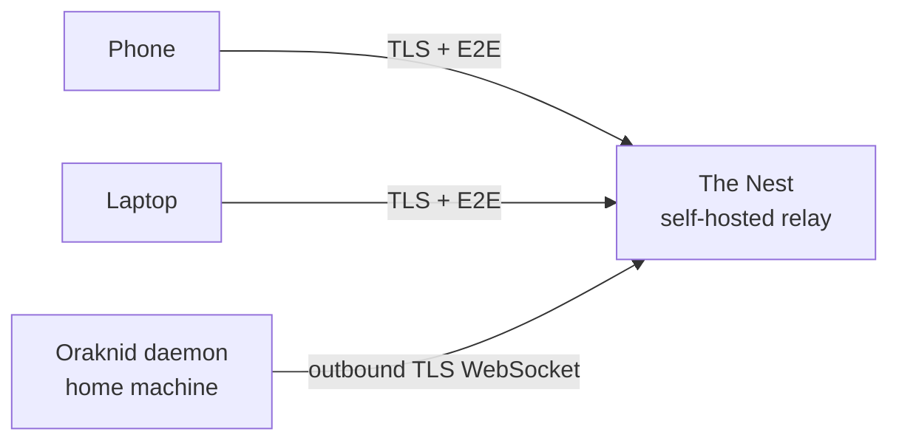

# The Nest *(Phase 4, built 2026-10-02 except web push)*

**Is:** a relay server I host myself, so I can reach my Oraknid from
anywhere (phone or desktop) without opening ports at home.
**Is not:** a cloud service run by anyone else, or a place where my job
data is stored.

## What I know now

- The daemon connects **outbound** to The Nest over a WebSocket (TLS).
  No port forwarding is needed.
- My devices connect to The Nest. It relays their requests to the daemon
  and the daemon's live updates back to them.
- **End-to-end encryption between device and daemon:** The Nest relays
  ciphertext and can't read jobs, Silk or approvals. Pairing exchanges
  keys between the device and the daemon. The Nest only knows device
  and daemon identities.
- Pairing for away happens at home: Settings → Away from home makes a
  link (and its QR code) holding that device's keys and token in the
  fragment, which a browser never sends to The Nest
  ([[Nest-Protocol]]).
- Web push to my phone works through The Nest.

## Decided (2026-10-02)

- E2E with libsodium ([[ADR-017-Nest-E2E-Protocol]]); a VPS with
  Docker Compose and Caddy, `deploy/nest/` ([[ADR-018-Nest-Hosting]]);
  the UI comes from the daemon through the tunnel, only a small loader
  from The Nest ([[ADR-019-Nest-UI-Serving]]).
- Several daemons per Nest: yes, each with its own id and secret in
  `NEST_DAEMONS`.
- Limits per address and per daemon, frame size and idle sockets.

## Still open
- Web push through The Nest (M4.3).

Related: [[Security]] · [[Realtime-Transport]] · [[Roadmap]]
