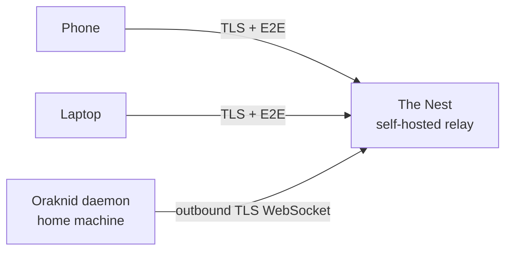

# The Nest *(Phase 4, built 2026-10-02; public mode Phase 11, 2026-10-03)*

**Is:** a relay server I host myself, so I can reach my Oraknid from
anywhere (phone or desktop) without opening ports at home.
**Is not:** a cloud service run by anyone else, or a place where my job
data is stored.

## What I know now

- The daemon connects **outbound** to The Nest over a WebSocket (TLS).
  No port forwarding is needed.
- My devices connect to The Nest. It relays their requests to the daemon
  and the daemon's live updates back to them.
- **End-to-end encryption between device and daemon:** The Nest relays
  ciphertext and can't read jobs, Silk or approvals. Pairing exchanges
  keys between the device and the daemon. The Nest only knows device
  and daemon identities.
- Pairing for away happens at home: Settings → Away from home makes a
  link (and its QR code) holding that device's keys and token in the
  fragment, which a browser never sends to The Nest
  ([[Nest-Protocol]]).
- Web push away from home: the loader holds the phone's subscription;
  the daemon sends pushes straight to the browser's push service,
  encrypted to the browser, so The Nest isn't involved.
- Every device away from home needs the PIN ([[ADR-029-App-Lock]]).
  A device with full rights also opens the terminal through the tunnel,
  on a channel of its own ([[ADR-030-Device-Rights]]).

## Decided (2026-10-02)

- E2E with libsodium ([[ADR-017-Nest-E2E-Protocol]]); a VPS with
  Docker Compose and Caddy, `deploy/nest/` ([[ADR-018-Nest-Hosting]]);
  the UI comes from the daemon through the tunnel, only a small loader
  from The Nest ([[ADR-019-Nest-UI-Serving]]), at `/app/`; its root is
  the product site ([[ADR-033-Product-Site]]).
- Several daemons per Nest: yes, each with its own id and secret in
  `NEST_DAEMONS`; a public Nest lets daemons register themselves
  ([[ADR-031-Public-Nest]]).
- Limits per address and per daemon, frame size and idle sockets.
- *(2026-10-03)* A Nest is private (the default) or public
  (`NEST_MODE=public`): in Settings → Devices & phone → The Nest, "Use a
  public Nest" registers this daemon in one click (address, by default
  `https://oraknid.abakdi.com`, and an invite code if it asks one); "My
  own Nest" takes the address, id and secret as before. A public Nest
  keeps only the hash of each registered daemon's secret, limits
  registrations, daemons, devices and bytes per day, and forgets a
  daemon unseen for 30 days. Its page says it is public and can't read
  what it carries. `install.sh` runs one Nest per domain, two on one
  server if I want ([[ADR-031-Public-Nest]]). Mine are
  `oraknid.abakdi.com`, public, and my private Nest, on the same server, both deployed 2026-10-03;
  `oraknid.abakdi.com` is the address Settings offers by default. My
  daemon stays on the public one until I re-pair my phone with the
  private one ([[Phase-11-Workspace]]).

## Still open
- Web push away from home is built (the loader holds the subscription;
  pushes go from the daemon to the push service, encrypted to the
  browser) but not yet tried on a phone.

Related: [[Security]] · [[Realtime-Transport]] · [[Roadmap]]
