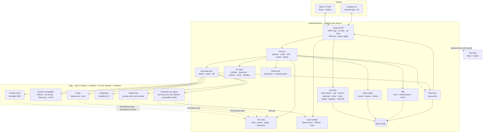

# Architecture Overview

One long-running Node.js daemon on my machine does everything. The web
UI is a PWA served by the daemon; the terminal app (`oraknid` alone,
[[Terminal-App]]) is a second client of the same API, and an install
can have it alone ([[ADR-055-Terminal-App]]). The Nest (Phase 4) is a
separate relay on a server I host.

## Layers

| Layer | Package | Holds |
| :-- | :-- | :-- |
| Contracts | `packages/contracts` | Zod schemas for every entity, API call, frame and event. |
| Core rules | `packages/core` | Pure functions: job and task life cycles (M1.3); routing (the ladder's rungs, the Claude share), budget math, drift detectors, a task's scope, context-pack assembly, the command policy, the Gate's decision (`harness/gate.ts`, a table of source × rules × grants × judge × autonomy), the harness's readings of an agent's words (quota, deprecation, a broken check, "the owner must"), admission (`admission.ts`, [[ADR-050-Parallel-By-Default]]), backups, cloud and rclone helpers. Fully unit-tested, no I/O. |
| Guard | `packages/guard` | Auto mode's layer 1 and the judge's shape ([[ADR-053-Auto-Mode]]): tree-sitter-bash parsing (`sh -c`, the far side of `ssh`), CC Safety Net and Oraknid's rules, the read-only list, secretlint for credentials going out, the judge's reasoning-blind prompt and cache, the stuck rule. |
| Leg SDK | `packages/legs/sdk` | `LegAdapter` interface, the contract test kit. |
| Adapters | `packages/legs/<kind>` | One per Leg kind: `claude-code`, `openai-compatible`, `opencode`, `antigravity`, `oraknid-agent` (Oraknid's own tool loop on the AI SDK, [[ADR-052-A-Harness-For-Any-Model]] §6), `codex` (OpenAI's Codex CLI headless, [[ADR-057-Codex-Adapter]]). |
| OS | `packages/os` | `Inhibitor`, `SecretStore`, `Metrics`, `Notifier`, `Sandbox`, `ServiceManager`; `linux/` now, `windows/` later. |
| Daemon | `apps/daemon` | Wiring: the step engine (`engine`), The Eye (`eye`: the program, attempts, talk and lookup, thinking, task memory, auto mode's daemon side), the Gate (`harness`, [[ADR-056-The-Harness]]), the supervisor and Leg registry (`legs`), the API (`api`), the event bus, recovery, the CLI and the terminal app (`cli.ts`, `tui`, Ink); and its services: the lock and devices (`auth`), the tools broker (`tools`), mail (`mail`), servers, oraknid-monitor and server jobs (`servers`), backups, cloud storage (`cloud`), local models (`models`), admission and the machine guard (`resources`), updates (`updates`), the terminal (`term`), chats, the helper, The Nest link (`nest`). |
| Web | `apps/web` | The UI. |
| Tunnel | `packages/tunnel` | The end-to-end tunnel between a device and the daemon (libsodium), used by the daemon and The Nest's loader ([[Nest-Protocol]]). |
| Nest | `apps/nest` | The relay and its loader page at `/app/` (Phase 4; public mode Phase 11). |
| Site | `apps/site` | The product site and guide, static, built into The Nest's root ([[ADR-033-Product-Site]]). |

## Data flow of one task

1. The Eye marks a task `ready` → the router scores Legs (core) → the
   chosen Leg is written to the database (step journal).
2. A Silk context pack is built (core + Silk store).
3. The supervisor starts or resumes the Leg's session through its
   adapter, inside the sandbox and the worktree.
4. Adapter events → the event bus → drift detectors (core), budget
   accounting, the database, and the WebSocket to the UI.
5. A permission request, a pre-tool hook or a tool call → the Gate: the
   never-allowed list and layer 1 (`packages/guard`), my rules and
   grants, the judge on doubt, the autonomy → allowed, blocked (told to
   the agent, counted by the stuck rule), or an inbox approval
   ([[Approvals-and-Autonomy]] → Auto mode).
6. The Leg runs the task's checks itself; Claude Code's Stop hook holds
   its turn while one fails. The Leg finishes → The Eye runs `verify[]`
   in the sandbox (or on the server, for an `ssh <alias>` check) → task
   `done` + checkpoint + Silk progress; a broken check is repaired; a
   real failure moves the task up the ladder with a handoff, or a drift
   escalates.

Before step 1, admission ([[ADR-050-Parallel-By-Default]]) decides
whether a ready task may start now; before the first attempt, each
check is tried once ([[ADR-052-A-Harness-For-Any-Model]] §2).
ADR-056 stage 3 (in progress) puts every attempt's facts in one attempt
log and the checks behind one Verifier.

## Process model

- The daemon is a single Node process. CPU-heavy work (ELK layout is in
  the browser; diffing and metrics parsing in the daemon) stays small.
  A worker thread is used if profiling shows a need.
- Each Leg session is a child process group (Claude Code, Antigravity;
  Codex, one `codex exec` per turn),
  a private server process spoken to over HTTP (OpenCode), or an HTTP
  stream (OpenAI-compatible and Oraknid's own agent, with tools executed
  by the daemon inside the sandbox; see [[Leg-Adapters]]).
- A loaded local model is a `llama-server` child process on a local
  port, or a model in the Ollama already on the machine
  ([[ADR-054-Local-Models]]).
- An update runs install.sh apart from the daemon (a transient
  `systemd-run --user` unit, or its own session) ([[ADR-048-Updates]]).
- Verification commands run as sandboxed child processes.

## Paths

| What | Where |
| :-- | :-- |
| Database | `$XDG_DATA_HOME/oraknid/oraknid.db` |
| Leg output logs | `$XDG_DATA_HOME/oraknid/logs/jobs/<job>/<session>.ndjson` |
| Leg homes and config dirs | `$XDG_DATA_HOME/oraknid/legs/<leg-id>/` |
| Config | `$XDG_CONFIG_HOME/oraknid/config.json` (non-secret) |
| Worktrees | `<project>/.oraknid/worktrees/<job>/` |
| Silk mirror | `<worktree or project>/.oraknid/silk/` |
| Mail kept here | `$XDG_DATA_HOME/oraknid/mail/drafts/<id>/` (drafts' attachments), `mail/local/<account>/` (POP messages) |
| Backups, daemon log, runtime file | `$XDG_DATA_HOME/oraknid/backups/` (the database's copies, before a migration, nightly and `pre-update-…`), `logs/daemon.log`, `daemon.json` (`{ pid, port }`) |
| The program, as installed | `$XDG_DATA_HOME/oraknid/app/` with `.oraknid-install.json` (what install.sh installed); `logs/update.log`, `updates/` ([[ADR-048-Updates]]) |
| Server jobs' folders | `$XDG_DATA_HOME/oraknid/server-jobs/<server>/` (a shadow repo each) |
| Local models | `$XDG_DATA_HOME/oraknid/models/<id>/`, `logs/models/<id>.log`; llama.cpp in `bin/llama.cpp` ([[ADR-054-Local-Models]]) |
| Oraknid's own agent's sessions | `$XDG_DATA_HOME/oraknid/legs/oraknid-agent-sessions/<session>.json` |
| Cloud storage | `$XDG_DATA_HOME/oraknid/cloud/rclone.conf` (encrypted), files in transit in `tmp/cloud` ([[ADR-046-Cloud-Storage]]) |
| The guard's configuration | `$XDG_DATA_HOME/oraknid/guard/` (CC Safety Net's home of Oraknid's own) |

Related: [[Leg-Adapters]] · [[Persistence-and-Recovery]] · [[Realtime-Transport]] · [[OS-Integration]] · [[Sandboxing]] · [[API-Contract]] · [[Data-Map]]
