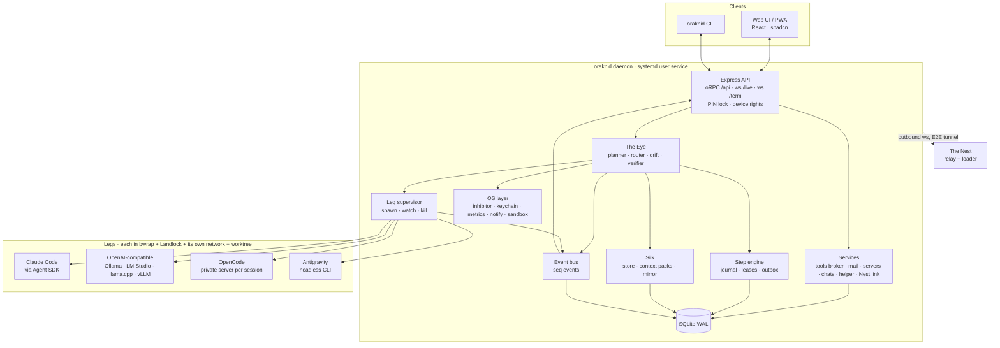

# Architecture Overview

One long-running Node.js daemon on my machine does everything. The web
UI is a PWA served by the daemon. The Nest (Phase 4) is a separate relay
on a server I host.

## Layers

| Layer | Package | Holds |
| :-- | :-- | :-- |
| Contracts | `packages/contracts` | Zod schemas for every entity, API call, frame and event. |
| Core rules | `packages/core` | Pure functions: job and task life cycles (M1.3); routing score, budget math, drift detectors and context-pack assembly as they arrive. Fully unit-tested, no I/O. |
| Leg SDK | `packages/legs/sdk` | `LegAdapter` interface, the contract test kit. |
| Adapters | `packages/legs/<kind>` | One per Leg kind. |
| OS | `packages/os` | `Inhibitor`, `SecretStore`, `Metrics`, `Notifier`, `Sandbox`, `ServiceManager`; `linux/` now, `windows/` later. |
| Daemon | `apps/daemon` | Wiring: the step engine, The Eye, the supervisor, the API, the event bus, recovery, the CLI; and its services: the lock and devices (`auth`), the tools broker (`tools`), mail (`mail`), servers and oraknid-monitor (`servers`), the terminal (`term`), chats, the helper, The Nest link (`nest`). |
| Web | `apps/web` | The UI. |
| Tunnel | `packages/tunnel` | The end-to-end tunnel between a device and the daemon (libsodium), used by the daemon and The Nest's loader ([[Nest-Protocol]]). |
| Nest | `apps/nest` | The relay and its loader page (Phase 4; public mode Phase 11). |

## Data flow of one task

1. The Eye marks a task `ready` → the router scores Legs (core) → the
   chosen Leg is written to the database (step journal).
2. A Silk context pack is built (core + Silk store).
3. The supervisor starts or resumes the Leg's session through its
   adapter, inside the sandbox and the worktree.
4. Adapter events → the event bus → drift detectors (core), budget
   accounting, the database, and the WebSocket to the UI.
5. A permission request → the policy → auto-answered, or an inbox
   approval.
6. The Leg finishes → the verifier runs `verify[]` in the sandbox → task
   `done` + checkpoint + Silk progress, or a failure prompt / escalation.

## Process model

- The daemon is a single Node process. CPU-heavy work (ELK layout is in
  the browser; diffing and metrics parsing in the daemon) stays small.
  A worker thread is used if profiling shows a need.
- Each Leg session is a child process group (Claude Code, Antigravity),
  a private server process spoken to over HTTP (OpenCode), or an HTTP
  stream (OpenAI-compatible, with tools executed by the daemon inside the
  sandbox; see [[Leg-Adapters]]).
- Verification commands run as sandboxed child processes.

## Paths

| What | Where |
| :-- | :-- |
| Database | `$XDG_DATA_HOME/oraknid/oraknid.db` |
| Leg output logs | `$XDG_DATA_HOME/oraknid/logs/jobs/<job>/<session>.ndjson` |
| Leg homes and config dirs | `$XDG_DATA_HOME/oraknid/legs/<leg-id>/` |
| Config | `$XDG_CONFIG_HOME/oraknid/config.json` (non-secret) |
| Worktrees | `<project>/.oraknid/worktrees/<job>/` |
| Silk mirror | `<worktree or project>/.oraknid/silk/` |
| Mail kept here | `$XDG_DATA_HOME/oraknid/mail/drafts/<id>/` (drafts' attachments), `mail/local/<account>/` (POP messages) |
| Backups, daemon log, runtime file | `$XDG_DATA_HOME/oraknid/backups/`, `logs/daemon.log`, `daemon.json` (`{ pid, port }`) |

Related: [[Leg-Adapters]] · [[Persistence-and-Recovery]] · [[Realtime-Transport]] · [[OS-Integration]] · [[Sandboxing]] · [[API-Contract]] · [[Data-Map]]
