# Roadmap

Written 2026-10-01. Phases follow the order I'll actually use the
product in: first replace babysitting Claude Code, then widen the pool,
then run several things at once, then reach it from anywhere.

```mermaid
flowchart LR
    P1[Phase 1<br/>MVP] --> P2[Phase 2<br/>OpenCode]
    P2 --> P3[Phase 3<br/>Parallelism]
    P3 --> P4[Phase 4<br/>The Nest]
    P4 --> P5[Phase 5<br/>Antigravity]
    P5 --> P6[Phase 6<br/>Non-coding skills]
    P6 --> P7[Phase 7<br/>Eye decision models]
    P7 --> P8[Phase 8<br/>Daily use]
    P8 --> P9[Phase 9<br/>Servers]
    P9 --> P10[Phase 10<br/>Lockdown]
    P10 --> P11[Phase 11<br/>Workspace]
    P11 --> P12[Phase 12<br/>Email]
    P12 --> P13[Phase 13<br/>Projects first]
    P13 --> L[Later<br/>containers · teams]
    L --> W[Final phase<br/>Windows]
```

| Phase | Delivers | Exit criterion |
| :-- | :-- | :-- |
| [[Phase-1-MVP]] · built; a reboot mid-job and a quota window still to try | Claude Code + OpenAI-compatible adapters, one job at a time, live UI, lossless pause/resume and crash recovery, sleep inhibition, the canon-driven skill with its interview, Linux service. | I run a real job on a real project with the canon-driven skill, from interview to verified completion, without touching a terminal. It survives a pause/resume, a `kill -9` of the daemon and a reboot without redoing work. |
| [[Phase-2-OpenCode]] · done: a job handed a task from Claude Code to OpenCode through Silk and completed verified (2026-10-02) | OpenCode adapter. Routing across three kinds. | A job uses Claude Code and OpenCode, with at least one cross-Leg handoff through Silk, and completes verified. |
| [[Phase-3-Parallelism]] · done: two jobs, four tasks at once, merged cleanly (2026-10-02) | Several tasks per job and several jobs at once, worktree isolation, merges, conflict handling. | Two jobs and four parallel tasks run together, merge cleanly or raise conflicts as tasks, and the machine stays responsive. |
| [[Phase-4-The-Nest]] · built and deployed (oraknid.abakdi.com); the phone test is mine | Self-hosted relay, E2E device-to-daemon, remote push. | From my phone on mobile data, I approve an action and answer a question on a job running at home. |
| [[Phase-5-Antigravity]] · done: a real job on an Antigravity Leg completed verified (2026-10-02) | Antigravity adapter, or a documented workaround. | An Antigravity Leg completes a verified task unattended, or an ADR records why that isn't possible and what replaces it. |
| [[Phase-6-Non-Coding-Skills]] · built ([[ADR-021-Tools-Broker]]); my real inbox to try, through the built-in email tool on my Mail account since Phase 12 (set aside 2026-10-02) | Skills declaring MCP tools, credentials scoped per job, the email flow. | The email skill runs read → classify → draft → approve → send → log on my real inbox, with every send approved. |
| [[Phase-7-Eye-Decision-Models]] · done ([[ADR-022-Eye-Decision-Models]]); The Eye on Claude, Jev not connected yet | Jev / Kev (or similar) behind `EyeBrain`. | The Eye runs a job with a dedicated decision model, and plan quality is compared against a pool Leg on the same job. |
| [[Phase-8-Daily-Use]] · built; GitHub with my token to try; GitLab and more helper actions left (M8.3, M8.7) | The New work page with the interview in it and drafts, skills per project, GitHub repos, markdown everywhere, readable screens, Chats, the Oraknid helper. | I start a project from a new GitHub repo through the page or the helper, go through the interview there, leave it as a draft and start it later; every log is readable; I talk to a model about it in Chats. |
| [[Phase-9-Servers]] · built; a job deploying to my server is mine to try | My servers over SSH: Oraknid's own key, read-only discovery, a state document kept current, servers per project, oraknid-monitor, a terminal in the web UI. | I add my VPS, it is discovered and documented, monitored, deployed to by a job through approvals with its document updated after, and I open a terminal on it from the web UI. |
| [[Phase-10-Lockdown]] · built; S2-21 closed 2026-10-03 by a network of its own per sandbox (with `passt` installed); the loader's code pinned (S2-02) still open | A PIN on every device checked by the daemon ([[ADR-029-App-Lock]]), [[Audit-2]] and its fixes, settings in tabs, pairing my phone in one step. | From my phone I open Oraknid with my PIN, and nobody without it can; a job can't reach anything on my computer outside its sandbox. |
| [[Phase-11-Workspace]] · built; both Nests deployed on my server, with the product site (2026-10-03); the mark kept, its pupil made vertical and gently wavy (2026-10-03); moving my daemon to the private one (re-pairing my phone) left | Pages in tabs that use their space, a folding sidebar, shortcuts, a terminal workspace, full rights for a chosen device ([[ADR-030-Device-Rights]]), a public Nest ([[ADR-031-Public-Nest]]), the app's own look and a product site ([[ADR-033-Product-Site]]). | The Eye's conversation fills my phone's screen; four terminals in a grid; a terminal on my server from my phone; another daemon on the public Nest, mine on my private one. |
| [[Phase-12-Email]] · built (IMAP and POP3, app passwords; OAuth later); my Gmail syncs (app password, 2026-10-03); an approved agent draft sent from it, and an IMAP account, to try | An email client in Oraknid, several accounts, agents that read, sort and draft, nothing sent without me ([[ADR-032-Email]]). | Gmail and an IMAP account end to end; an agent drafts a reply I approve and send. |
| [[Phase-13-Projects-First]] · built through M13.17 (2026-10-04); the piano job's last push check (mine to resume) and M13.12's SQLite files and in-container sizes left | The project is the place, jobs its history ([[ADR-034-Projects-First]]); what a public and a private Nest show ([[ADR-035-Nest-Pages-By-Mode]]); the one-script install ([[ADR-036-One-Script-Install]]); questions with options ([[ADR-037-Questions-With-Options]]); a project's GitHub repo and servers ([[ADR-038-Project-Accounts]]); plan usage in view ([[ADR-039-Plan-Usage-In-View]]); Repos ([[ADR-040-Repos-Page]]); Docs and a guiding helper ([[ADR-041-Docs-And-A-Guiding-Helper]]); several repos and servers ([[ADR-042-Several-Repos-And-Servers]]); server insight ([[ADR-043-Server-Insight]]); backups ([[ADR-044-Backups]]); The Eye speaks up ([[ADR-045-The-Eye-Speaks-Up]]); cloud storage ([[ADR-046-Cloud-Storage]]); jobs named by what they are (M13.17). | I ask for new work on a project from its Eye tab and follow it there to the end; nothing on my private Nest is found. |
| Later | Containers per job, teams and roles. | Planned when they come up. |
| Final phase — Windows | Windows service, inhibitor, Credential Manager, metrics, sandbox equivalent. | The Phase 1 exit criterion passes on Windows. |

Status as of 2026-10-04: Phases 1 to 12 are built and tested on `dev`;
what's left in each is hands-on (mine), named in its phase note. Phase
13 is built on `dev` through M13.17, with its fixes after; open: the
piano job's last push check (mine to resume), M13.12's SQLite files and
in-container sizes, and Audit-2 S2-02 (fixed in part). Next: those
hands-on runs, then Later.

Phase notes for Later and the Windows phase are written when their turn comes.

## Changes of order

**2026-10-03 — Phase 13, Projects first, added after Phase 12.** The
job page beside the project page confused me; the project becomes the
place and jobs its history. With it, what each kind of Nest shows.

**2026-10-03 — Phase 12, Email, added after Phase 11.** My mail is
where much of my work starts and ends: in Oraknid, with the agents
reading, sorting and drafting, before containers and teams
([[ADR-032-Email]]).

**2026-10-03 — Phase 11, Workspace, added after Phase 10.** From my
list after using Oraknid on my phone and my PC: pages that use their
space, a terminal workspace, full rights for a device I choose, and a
Nest that can serve other people's daemons.

**2026-10-02 — Phase 10, Lockdown, added after Phase 9.** The Nest put
Oraknid on the internet: before anything else, nobody but me drives it,
on any device, and a job stays inside its sandbox.

**2026-10-02 — Phase 9, Servers, added before Later.** Where my work
ends: servers known, documented, monitored and reachable from Oraknid.

**2026-10-02 — Phase 8, Daily use, added before Later.** From my list
of what gets in the way when I use Oraknid every day: starting work,
repos, readability, chats and a helper come before containers and teams.

**2026-10-01 — Windows moved to the very end.** It was Phase 7, ahead
of the Eye decision models and of containers and teams. Now it comes
after everything else. I want a fully working system on Linux first.
The Windows parts (service, inhibitor, keychain, metrics, sandbox) are
added last, for Windows developers. The OS interfaces in `packages/os`
stay, so nothing Linux-specific leaks into the rest of the code in the
meantime. The Eye decision models become Phase 7.

Related: [[Vision]] · [[Product-Requirements]] · [[Phase-1-MVP]]
