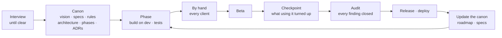

# Canon-Driven Development

*Canon*, as in canonical: the authoritative text, the one source of
truth, the revelation everything else answers to. In this method the
canon is the project's docs folder. It says why the project exists,
what it does, how it is built, in what order, and what was decided and
why. Code is written from it, tested against it, and corrected when it
disagrees with it. When the plan changes, the canon changes first.

The short version:

1. **Understand before writing.** Ask the owner questions until the idea is clear.
2. **Write the canon before the code.** Vision, specifications, rules, architecture, phases, decisions.
3. **Build one phase at a time**, on a development branch, with tests and a hands-on check.
4. **Use it, then write down what hurt**: a checkpoint.
5. **Look hard at it from outside**: an audit, every finding fixed or explained.
6. **Ship through a fixed chain**: betas, release, deploy, each tried by hand first.
7. **Keep the canon true.** Every change of plan is written into it, with the reason and the date.

---

## 1. Starting a project: ask until it is clear

When the owner starts describing a project, **do not create any files
yet.** The first job is to understand it well enough to write a
specification someone else could build from. Ask in rounds, a few
questions at a time, and keep going until every point below has an
answer, or a recorded "decide later".

Ask about:

- **Why it exists.** The problem, for whom, and what the owner does today instead. What it must *feel* like to use.
- **Who uses it.** One person, a team, the public. Accounts or not.
- **The core loop.** What someone does with it every day. What the first usable version (the MVP) is, and what is explicitly *not* in it.
- **The things it holds.** The main entities, what each one carries, how they relate, and what ends their life (finished, archived, deleted).
- **The rules that never bend.** Time boundaries, limits, money, privacy, fairness. These become the business rules.
- **Platforms.** Mobile, web, desktop, server. Which comes first.
- **Data and privacy.** Where data lives, what leaves the device, who can read what, what must be exportable.
- **Languages, accessibility, look.** Locales and right-to-left scripts, light and dark, a reference product or style.
- **Constraints.** Stack preferences, hosting, budget, deadlines, anything already decided.
- **Order.** What should exist first, second and third, and why.

How to run the interview:

- Open questions first, then narrower ones. When the owner is unsure, offer options with a recommendation.
- After each round, play back a short summary and ask "is this right?" before going on.
- When an answer contradicts an earlier one, point it out and ask which wins.
- Never guess to fill a gap. Undecided points go into the canon as open questions.
- Stop only when the vision, the requirements, the data model and the business rules could be written without inventing anything. Say so, list the documents you will create, and only then create the canon.

---

## 2. Repository layout

Two shapes work. Choose one with the owner during the interview.

### A. One monorepo

Everything in one repository, laid out by program, with the canon
inside it:

```
apps/
  <client>/       e.g. a mobile app
  <client>/       e.g. a web app
  <server>/       the API
packages/
  contracts/      the wire format: every request, response and stored record, defined once
  core/           the shared rules (dates, limits, scoring), implemented once
deploy/           infrastructure: compose files, proxy config, deploy and backup scripts
docs/             the canon
README.md
```

Shared rules live in one place and the wire format lives in one place,
so the programs cannot drift apart. A program written in another
language, which cannot import them, is held to them by **fixture
files** that both sides test against. Record the layout as a decision
(section 3, `04-Decisions/`).

### B. A canon repository with the code repositories inside it

When the code must live in separate repositories (separate deploys,
separate owners, an existing codebase), the canon gets a repository of
its own and the code repositories are cloned *inside* it, then ignored:

```
project/                ← the canon repository
  docs/                 ← the canon, committed here
  README.md
  .gitignore            ← lists every cloned code repository below
  client/               ← its own git repository, cloned here
  server/               ← its own git repository, cloned here
```

```gitignore
# Code repositories, each with its own history
/client/
/server/
```

- Each code repository is committed and pushed **on its own**, from inside its folder, with its own branches and tags.
- The canon repository commits the canon: specifications, plans, checkpoints, audits.
- A change that spans repositories is one commit in each, each message standing on its own, plus one canon commit recording it.
- The canon repository's README lists every code repository, its remote, and how to clone it into place.

---

## 3. The canon (`docs/`)

Plain markdown with `[[wiki links]]` between notes (Obsidian reads it
as a vault, but any editor works), mermaid diagrams, and tables. When
the code and the canon disagree, one of them has a bug, and it is fixed
the same day.

```
docs/
  Home.md
  00-Overview/
  01-Specification/
  02-Architecture/
  03-Planning/
  04-Decisions/
  05-Checkpoints/
  06-Audit/
```

### `Home.md` — the map

The entry point: a one-line tagline, then a map of contents grouped by
folder, every note with a one-line description of what it holds. Mark
where the project stands (`← the MVP`, `← next`). Every new note is
added here when it is created.

### `00-Overview/` — why, and the words used

| Note | What it holds |
| :-- | :-- |
| `Vision.md` | Where the idea comes from, what it must feel like, its main pillars, and scope discipline: what the MVP is and what waits. |
| `Product-Requirements.md` | The consolidated requirements: a summary, an entities table, a modules table (each row linking to its specification), the business rules in one paragraph, the technical foundation. It links out rather than repeating. |
| `Glossary.md` | Every domain term with its one meaning, used identically in the interface, the code and the canon. |

### `01-Specification/` — what it does

One note per feature or module, plus two foundations:

- **`Core-Entities.md`** — the data model: every entity, its fields, its life cycle.
- **`Business-Rules.md`** — the project's constitution: a numbered table (`| # | Rule | Detail |`) of rules that never bend. A feature that conflicts with a rule is wrong, not the rule. New rules are appended with a link to the checkpoint or audit that produced them.

A feature specification contains:

- **What it is, and what it is not** (`Is:` / `Is not:`), and why it belongs in the product.
- What it holds, as tables: kinds, fields, states.
- Each flow, step by step, with the edge cases decided.
- Its own numbered rules where it needs them (`<prefix>1`, `<prefix>2`, …).
- What is stored where, what syncs, what is exported, what a server can see.
- Which phase or checkpoint delivers it.

Write specifications so they can be tested against: concrete numbers,
named states, and what the product *says* when something fails, never
a silent failure.

### `02-Architecture/` — how it is built

One note per technical area: an overview (layers, data flow, package
layout), storage, state management, the API contract (every route in
a table), a data map (where each piece of data lives and who can read
it), deployment, theming, localization, background work. A diagram for
anything with more than two moving parts.

### `03-Planning/` — in what order

- **`Roadmap.md`** — a diagram of the phases and a table `| Phase | Delivers | Exit criterion |`. When a phase ships, its row records the version and date. Below the table, **a dated paragraph for every change of order**: what moved, ahead of what, and why.
- **`Phase-N-<Name>.md`** — one note per phase:
  - A line naming the specifications it touches and the date it was written.
  - **Why**: the problem the phase solves, with a table of where things stand today when that helps.
  - **Milestones** numbered `M<phase>.<n>`, each a heading with a checklist.
  - Checklist marks: `- [ ]` to do, `- [x]` done, `- [~]` decided otherwise or done in part, with one line saying what was decided instead.
  - An exit criterion that can be checked, never a feeling.

Order phases by how the product will actually be used, not by
technical convenience. The MVP is the smallest thing the owner would
use every day instead of what they use now.

### `04-Decisions/` — why it is built that way

Architecture decision records, numbered and never renumbered:
`ADR-001-<Topic>.md`, `ADR-002-<Topic>.md`, …

```markdown
# ADR-00N — <the decision, as a sentence>

**Status:** Accepted · <date> · [[<phase it belongs to>]]

## Context
What forced a decision, and what was true at the time.

## Decision
What was chosen, concretely: a layout, a library, a rule.

## Consequences
What gets easier, what gets harder, what is now ruled out.
```

Add a `## Why not <alternative>` section for each serious alternative.
A reversed decision gets a new ADR that supersedes the old one; the
old one's status line says so.

### `05-Checkpoints/` — what using it turned up

A checkpoint is taken after living with a build, or when the owner
brings a batch of bugs and requests. `Checkpoint-N.md`:

```markdown
# Checkpoint N — <the theme, in a few words>

Opened <date>, after `v<version>`. What prompted it, in two or three
sentences. Ships as `v<next version>`.

## Bugs

### B<N>-01 — <what the person sees, in their words> (<where>)

**Seen:** the exact behaviour, where, on which version.
**Why:** the real cause, found rather than guessed. If it is still a guess, say so.
**Fix:** what changed.
**Tests:** the automated test, and what was tried by hand.

## Features

| # | What | Where |
| :-- | :-- | :-- |
| F<N>-1 | … | … |

## Where it stands (<date>)

- [x] B<N>-01 — one line, and how it was verified.
- [ ] F<N>-2 — what is still open, and why.
```

When the first explanation of a bug turns out wrong, rewrite the entry
with the real cause. A wrong explanation is never left standing.

### `06-Audit/` — looking hard at what is there

An audit stops feature work to review what exists. `Audit-Home.md` is
the index and the **status board**; each audit has its own report.

An audit report contains:

- **How it was run**: the angles (security, code quality, performance, each client tried by hand), the tools, the data set, and the screen sizes, languages and themes covered.
- **An ID prefix per angle and round**, e.g. `S<round>-` security, `Q<round>-` quality, `P<round>-` performance, `U<round>-` a client by hand.
- **One table per angle**: `| ID | Severity | Where | Finding | Status |`, where the status is **Fixed** (and how) or **Documented** (and why it stays).
- **Where it ended**: the count, how many were fixed, what was deferred and why.

Nothing changes while auditing. A remediation pass then fixes the
findings in waves, each wave ending with static checks clean, tests
green and a check by hand. An audit is finished when every finding is
fixed or explained.

### How the canon is written

- **In the owner's voice, first person.** "I want…", not "the user wants".
- Short paragraphs; tables for anything with rows; a diagram where a flow branches.
- Every note ends with `Related: [[A]] · [[B]]`.
- Absolute dates (`2026-01-31`), never "yesterday" or "last week".
- What is not done or not known is said plainly. A canon that admits a gap is worth more than one that hides it.

---

## 4. Working a phase

1. **Plan in the canon.** Write or update the phase note with milestones and checkboxes, update the roadmap, write specifications for anything new, and an ADR for every real choice. Commit the canon first.
2. **Build** on the development branch, milestone by milestone. Shared rules go into the shared package and every program uses them.
3. **Test as you go**: unit tests for rules, integration tests for the API against a real database, component tests for screens. Every bug fixed gets a test that would have caught it.
4. **Try it by hand** on every client the phase touched, in every language and theme the product supports.
5. **Tick the boxes** as things land; mark `[~]` with a line where something was decided differently.
6. **Bring the canon up to the code** before the release: specifications, data map, API table, rules.

### When something new comes up

New requests, bugs and changes of mind are expected. They go into the
canon before they go into the code:

- A bug or a request → the current checkpoint, or a new one.
- A new feature → its specification, and a milestone in a phase.
- A change of order → the roadmap, with a dated paragraph: what moved, ahead of what, and why.
- A changed decision → a new ADR.
- A new invariant → the business rules, or the feature's own rules.

Then add any new note to `Home.md`.

---

## 5. Commits, branches, versions

### Branches

- **`dev`** is where work happens. Every commit lands there first.
- **`main`** holds what has been released. It moves only by a merge from `dev` at a release: `git merge --no-ff dev -m "Merge dev: v<version> — <the release's theme>"`.
- Experiments that may be thrown away get their own branch and are never merged without the owner's yes.

### Commit messages

A conventional prefix, lower case, then the outcome in plain words, as
someone using the product would notice it, rather than the mechanism:

```
feat: <what someone can now do>
fix: <what no longer goes wrong, and where>
docs: <which part of the canon, and what it now says>
test: <what is now covered>
chore: v<version>
style: <formatter> format
```

- Prefixes: `feat`, `fix`, `docs`, `test`, `chore` (versions, tooling, housekeeping), `style`, `refactor`.
- The body, wrapped at about 72 columns, says **why**: the problem, the cause, the change, anything surprising. It should still make sense to someone reading the history a year later.
- One logical change per commit. Canon updates can ride with the change they record, or follow straight after as a `docs:` commit.
- Commit and push only when the owner asks, or as part of a release they asked for.
- Messages and documents are written in the owner's voice; attribution lines are added only if the owner wants them.

### Versions

- Semantic versioning: `vMAJOR.MINOR.PATCH`. A major version is a judgement about how much the product changed for the person using it, not how much code changed; write that reasoning in the roadmap.
- Large releases go out as betas first: `v<x.y.z>-beta.1`, `-beta.2`, each a tag and a pre-release.
- A version bump is its own commit (`chore: v<version>`), and the version is defined in one place that every program reads.

---

## 6. Quality gates

Nothing ships without passing these, in order:

1. **Static checks**: type checking, linting and formatting for every program touched.
2. **Test suites**: every package green. API tests run against a real database in a container, not a mock.
3. **By hand, for real**: install the release build on a device or emulator and drive the changed screens; open the production build in a browser and drive the changed pages, including installation, offline use, every language and theme, and a phone-sized screen.
4. **The canon agrees with the code**: checkpoint entries closed, phase boxes ticked, specifications and API tables updated.

For releases, additionally:

- An **audit** before a major release or after a large phase, finished before the release.
- A **beta** first when the change is large. What the owner and testers find becomes the next checkpoint.
- Report what was tested and how, plainly. Anything that could not be tested (a real device, a particular browser) is named, with what to check.

---

## 7. Releasing and deploying

Only when the owner asks, and each step is checked before the next:

1. All quality gates green.
2. The version bump commit; merge `dev` into `main`; tag; push both branches and the tag.
3. Build the release artefacts (signed, with the signing identity verified) and the server images from the tagged commit.
4. **Back up the production data**, encrypted, before touching the server.
5. Deploy that exact commit, and check from outside that it answers.
6. Publish the release with notes written for the person using the product: what is new and what is fixed, in their words.
7. Try the live product once more by hand, then record the version and date in the roadmap and the checkpoint.

Secrets (keys, passwords, tokens) never enter the repository, the canon
or any notes. They are loaded only when needed and discarded after.

---

## 8. The cycle


